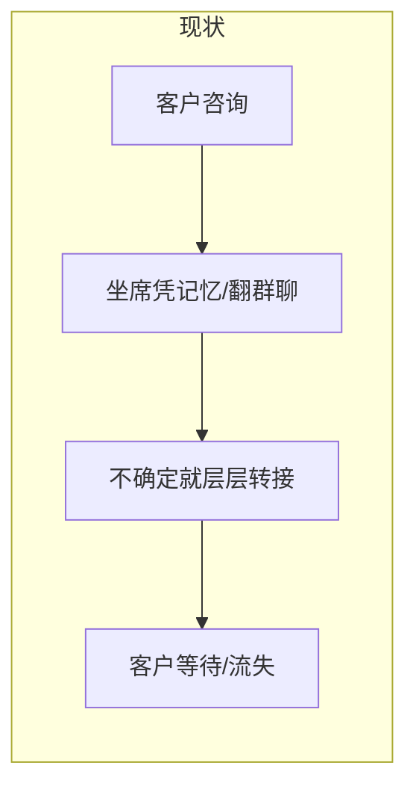
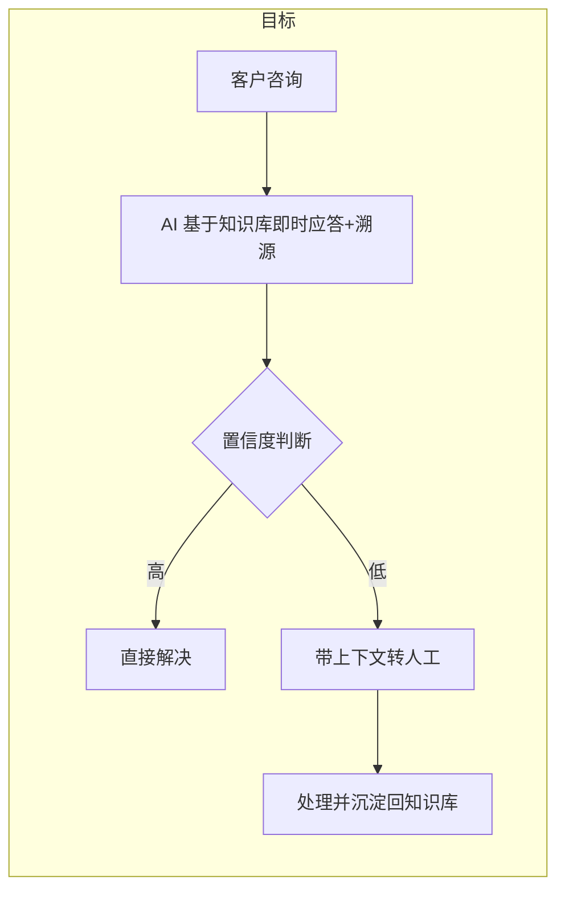

# 解决方案写作方法论 · 私人定制（售前）

> 定位：写给**一个具体客户**的售前解决方案——尽调之后，用这个客户的真实痛点、数据、系统和决策链，写一份"换掉客户名就失效"的方案，拿下这一单。
> 原则：方案是**面向客户的专业能力展示**——告诉客户"我们懂这个问题、能解决它、可以信任我们"，而不是团队内部资产。文中不得出现"团队资产、可复用、方法论沉淀、参考框架"等内部话语。
> 适用：售前需求评估（SOP2）、POC 方案、生产实施方案的对外表达。
> 配套：`03-解决方案角色职责.md`、`fastgpt-expert` skill（价值口径/交付规范）。
> 区分：**公开的解决方案中心文章（报销助手、智能客服等，面向大众吸引客户）走另一条线**，见《解决方案写作方法论-公开通用.md》——那条线要"换名仍成立"，与本文件"换名失效"相反。

---

## 一、先立标尺：什么才算"好方案"

写之前先拿 5 条标准自测，任何一条不满足，方案都还没及格：

| # | 标准                                                         | 反例（泛泛而谈）                     | 正例（一针见血）                                                                  |
| - | ------------------------------------------------------------ | ------------------------------------ | --------------------------------------------------------------------------------- |
| 1 | **懂客户**：方案里有"这个客户"的痕迹，换了客户名就失效 | "某企业普遍面临效率低、成本高的问题" | "售后坐席日均 3500 通咨询，晚高峰排队超 4 分钟"                                   |
| 2 | **痛点有因链**：现象 → 影响谁 → 根因，不列孤立现象   | "客服响应慢，服务质量参差不齐"       | "知识分散在 23 个文档和群聊，坐席凭记忆回答 → 晚高峰排队 → 客户流失 + 加班成本" |
| 3 | **方案有因果闭环**：每个方案模块对应一个根因           | "FastGPT 支持 RAG、工作流、多渠道"   | "知识库统一解决'知识分散'，分级工作流解决'层层转接'"                              |
| 4 | **价值可量化**：落地前 → 落地后 → 为什么变           | "显著提升效率，大幅降低成本"         | "首响从 3 分钟降到 12 秒，因为 AI 直接检索知识库并溯源"                           |
| 5 | **路径可落地**：告诉客户 POC→试点→规模化怎么走       | "全面覆盖各业务场景"                 | "先验知识库命中率，再上客服场景，跑通后复制到售后和售前"                          |
| 6 | **打动决策者**：有专门写给拍板人的话——回本周期、风险边界、战略价值，而不只写给一线用户 | "全面提升企业数字化水平"             | "预计 6-9 个月回本；首批仅在售后部门试点，验证达标后再复制到售前与运营"           |

> 记忆锚点：好方案 = **客户能对号入座**（细节）+ **问题有解药**（因果）+ **数字能拍板**（机制）+ **高管能拍板**（回本/风险/战略）。

---

## 二、泛泛而谈的 8 大雷区（写之前先扫一遍）

1. **功能清单式**：罗列"支持 RAG、支持工作流、支持多渠道"。这是产品介绍，不是解决方案。客户要的是"你帮我解决了什么问题"，不是"你有什么功能"。
2. **行业贴皮**：只改客户名、行业名，正文一模一样。客户一眼看穿。
3. **痛点停在现象**："效率低、成本高、响应慢"。没有因链、没有具体岗位/场景/数据，等于没诊断。
4. **承诺不可控**："准确率 99%""全面解决所有问题"。没有边界 = 不专业 = 交付时翻车。
5. **只有方案没有流程**：不告诉客户"我的人和系统怎么用起来"。客户最怕买回去没人会用。
6. **数字悬浮**："提升 80%"没有前后对比、没有变化机制。数字没有根，客户不信。
7. **完美叙事**：全篇没有冷启动爬坡、没有仍需人工的环节。太完美 = 不可信。
8. **缺交付路径**：讲了一堆能力，客户不知道"什么时候能用上、先做什么、找谁配合"。

---

## 三、写前尽调：懂客户的原料

"懂客户"不是文采，是**取材**。标准 1 要求"换了客户名就失效"，这个细节不是靠想出来的，是靠问出来、看出来的。动笔前先把三类原料拿齐——拿不到的，写"待确认"，不要硬编。

### 3.1 取材清单（拿到手才算懂）

- **业务事实**：月均工单/咨询量、峰值时段、转接率、处理时长、满意度、投诉量（带口径）。
- **组织与岗位**：对接部门组织架构、关键岗位（谁做、谁审、谁拍板）、团队规模与排班。
- **流程与 SOP**：现有业务流程 / 审批链 / 权限边界，标出"断点"——靠人肉、靠记忆、靠层层转接的地方。
- **系统现状**：现有系统清单（OA / CRM / ERP / 工单 / 财务 / IM）、谁在用、接口能力、数据在哪。
- **知识与制度**：制度、SOP、FAQ、历史答疑记录、工单沉淀——既是知识库冷启动的原料，也是方案能否落地的硬约束。
- **决策与预算**：发起人是谁、最终拍板人是谁、预算范围、采购周期、今年战略重点、内外部压力。

### 3.2 必问问题（访谈对接人，先问这 6 个）

1. 现在这个流程里，**谁在哪个环节最痛苦、每天花多少时间**？（找真实场景，不是听汇报）
2. 你们**现在怎么解决**？（现有系统、人工兜底、还是忍着？——决定了方案的"替代成本"）
3. 三个月内不改，**最大的损失或风险是什么**？（把痛点推到战略层，给高管看的钩子）
4. **谁决定买不买、谁决定用不用**？（决策链 vs 使用链，决定方案写给谁看）
5. 验收时你们**最看重哪个指标**？（别自定指标，先问客户要什么）
6. 有没有**必须先补的前置条件**（制度不全、数据没有、接口不通）？（决定方案的现实起点）

### 3.3 尽调 → 方案的三条转化

- **拿不到量化 → 只写定性量级**：写"日均数百通""峰值排队超数分钟"这类脱敏量级，不编具体数。
- **SOP 不清 → 只画现状层**：流程不清楚，方案停在"现状痛点"层，不硬套目标流程。
- **决策链不明 → 价值章节先留白**：不知道谁拍板，就标"待与决策人确认"，不写错对象。

> 尽调不到位就动笔，是"痛点因链"失灵的根本原因——因链的原料是事实，不是形容词。

---

## 四、核心方法论

### 4.1 痛点因链（方案的心脏）

把痛点写成一条因果链，挖到根因，根因必须指向**可被方案解决的点**：

```
现象 → 影响谁（成本/流失/风险/效率） → 根因（知识分散 / 系统割裂 / 人工波动 / 无沉淀）
```

**示例（某连锁零售售后客服中心）：**

> 现象：售后坐席日均处理 3500 通咨询，晚高峰平均排队超 4 分钟，人工转接率 38%。
> 影响：高峰排队导致客户流失；坐席长期加班增加人力成本；高频重复问题占用资深坐席时间。
> 根因：
> ① 知识分散在 23 个文档、群聊和工单系统，坐席靠记忆回答，答案口径不一致；
> ② 复杂问题层层转接、跨系统翻资料，无结构化沉淀；
> ③ 新员工培训周期 3 个月，成长依赖老员工带。

这条因链直接决定了后面方案的三根支柱：**知识库统一**（打①）、**分级工作流**（打②）、**智能辅助培训**（打③）。因链挖得有多深，方案就有多站得住。

### 4.2 方案-痛点因果闭环

每个方案模块必须对应一个根因，形成"根因 → 方案 → 结果"的闭环。方案里禁止出现"这个模块很强大"的孤岛表述。

| 客户根因             | 方案模块                                           | 方案后结果               |
| -------------------- | -------------------------------------------------- | ------------------------ |
| 知识分散、口径不一致 | 企业知识库统一接入制度/FAQ/工单沉淀                | 坐席答案口径一致，可溯源 |
| 复杂问题层层转接     | 分级处理工作流：高频直接答、低频转人工、高风险复核 | 转接率下降，资深坐席释放 |
| 新员工上手慢         | 智能辅助：按流程引导 + 话术沉淀                    | 培训周期缩短             |

### 4.3 指标三件套（每个数字都要解释"为什么变"）

**落地前数值 → 落地后数值 → 变化机制**，三件缺一不可。

> AI 味：显著提升响应速度，大幅降低人力成本。
> 质感版：FAQ 首响时间从 3 分钟降到 12 秒——因为 AI 直接从知识库检索答案并附原文出处，替代了坐席跨系统翻文档；晚班坐席从 6 人降到 2 人——因为 70% 高频问题由 AI 直接应答。

**口径纪律**：未经客户验证的数据写"保守估算 / 脱敏行业参考 / 待 POC 验证"，不伪装成审计数据。

### 4.4 细节锚点（每模块至少一处）

细节落到**角色、时间点、动作、入口、文件类型、复核动作**。写"谁在什么时候用什么入口做了什么"，不写"实现了智能化升级"。

- 好：市场部同学在飞书机器人里发一句"帮我查上月华东区退货率"，12 秒返回带数据来源的报表。
- 差：系统支持多端访问，提升了信息获取效率。

### 4.5 人机分工表（告诉客户"谁做什么"）

客户最怕买回去没人用。给一张明确的分工表，AI 不是替代人，是重新分配人：

| 环节             | AI 全自动 | AI 生成 + 人工确认 | 人工主导 |
| ---------------- | :-------: | :----------------: | :------: |
| 高频 FAQ 应答    |    ●    |                    |          |
| 工单分类与转派   |    ●    |                    |          |
| 合同关键条款初筛 |          |         ●         |          |
| 高风险投诉处理   |          |                    |    ●    |
| 质检复核         |          |         ●         |          |

### 4.6 流程透视图（现状 vs 目标）

用业务语言画两条流程，让客户一眼看到"断点在哪、怎么接上"。**只画业务流程，不暴露工作流内部实现**。





### 4.7 真实感（允许"不完美"）

- 写**冷启动爬坡**：知识库整理需要 N 周、上线初期准确率爬坡、每周复盘动作。
- 写**人工兜底**：低置信度转人工，质检复核——谁复核、复核什么、复核后怎么回流。
- 没有代价、没有仍需人工的环节 = 不可信。

### 4.8 系统性全链路

一份系统性方案必须覆盖闭环，缺一段都会让客户觉得"想得不全"：

```
需求理解 → 数据与知识工程 → 流程编排 → 系统集成 → 权限安全 → 发布渠道
   → 人机分工与员工采用 → 运营与持续优化 → 效果复测 → 场景复制
```

### 4.9 高管决策共鸣（决定成单率的最后一公里）

方案最终要过的关不是一线用户，是**拍板的高管**。一线用户决定"好不好用"，高管决定"值不值得买"。同一份方案必须同时打动两层人，而高管这一层最常被写成套话。

**高管只问 5 个问题**，方案必须逐一正面回答：

| 高管的问题 | 方案里落在哪 | 怎么写 |
| --- | --- | --- |
| 这钱花得值不值？ | 回本周期、可量化价值 | 给"投入 → 回本周期 → 年化收益"的估算，标注假设 |
| 多久能看到效果？ | 实施路径的时间轴 | POC 用几周验证、试点几个月、何时规模化 |
| 有什么风险？ | 风险、边界、前置条件 | 主动写"哪些做不了、需要客户配合什么"，反而更可信 |
| 对战略/竞争力有什么用？ | 战略价值一句话 | 把方案接到客户的战略议题（降本、提效、合规、规模化） |
| 组织接得住吗？ | 人机分工、采用、持续运营 | 说明"谁用起来、谁兜底、怎么越用越准" |

**分层读者映射**：不同角色读同一份方案，关心点不同，正文/附录分工对齐：

| 读者 | 最关心 | 方案中的位置 |
| --- | --- | --- |
| 业务负责人/VP | 业务指标、团队效率、场景覆盖 | 执行摘要 + 一、三章 |
| CEO/CFO | 回本周期、合规风险、战略价值 | 执行摘要 + 三章 + 五章 |
| CIO/CTO | 架构、安全、集成、扩展性 | 附录 + 五章 |
| 采购/财务 | 总拥有成本、License、边界责任 | 附录 + 三章 |

**执行摘要就是写给高管的**：四句话——痛点一句话（戳到战略层）、方案一句话（是路径不是功能）、价值 3 个数字（带回本周期）、下一步一句话。写完自测：**把执行摘要单独发给 CEO，他能直接拍板吗？** 不能就是没写好。

**避雷**：对高管不写功能清单、不写技术细节、不写"赋能降本增效"；写"投入多少、多久回本、风险多大、下一步做什么"。

### 4.10 渠道 × 场景覆盖（全面性）

客户一定会问："我们的入口在飞书、钉钉还是企微？小程序和公众号接不接？"方案必须把客户正在用的入口都点到，并说明**同一套 AI 能力如何复用**，而不是每个入口重做一遍。

**渠道清单（写方案时逐项对照，能覆盖的都点到）**：

| 渠道 | 接入方式 | 典型场景 |
| --- | --- | --- |
| Web 免登录窗口 | 分享链接 / iframe / 挂载官网 | 外部客户问答、试用、官网客服 |
| API 接入 | 应用级 API Key | 自研系统、小程序、业务后端、第三方前端 |
| 飞书机器人 | API 接入飞书 | 飞书群聊/单聊、内部协作、流程提醒 |
| 钉钉机器人 | API 接入钉钉 | 钉钉组织内问答、审批/运维协作 |
| 企业微信机器人 | API 接入企微 | 企微客户群、内部群、企业客服 |
| 微信公众号 | API 接入公众号 | 公众号客服、服务号/订阅号问答 |
| 微信个人号 | ClawBot 接入 | 微信私域、个人号运营、轻量客服 |
| 团队门户 | 登录门户直接对话 | 团队统一入口、内部应用门户 |

**写法要求**：不罗列"支持多渠道"五个字，落到客户场景——"员工在飞书群里 @机器人 问差旅标准，客户在公众号里问订单进度，同一套知识库和流程在背后复用"。每个渠道至少给一句"谁在哪个渠道做什么"的细节锚点。

**注意**：小程序不是独立渠道，经 API 接入自研业务；写"支持小程序"要写成"经 API 对接自有小程序"。

### 4.11 长尾与边界场景枚举法（经得起生产追问）

方案最容易翻车的地方是**只写了 happy path 主流程**。客户一句"那退款怎么处理？跨部门怎么分摊？"就能问倒一个演示级方案。系统性方案必须主动把长尾和边界场景列出来，逐项说明 AI 与人工如何分工。

**枚举四问**（写任何场景，用这四问把边界逼出来）：

1. **金额/数量异常**：多币种、跨部门分摊、红冲退款、负数/超额、批量提交？
2. **数据/凭证异常**：缺字段、识别不确定、口径冲突、历史脏数据、重复提交？
3. **权限/合规异常**：敏感数据、越权访问、审计留痕、审批越级、合规否决？
4. **流程/系统异常**：系统接口超时、回调失败、并发峰值、断点续跑、人工介入点？

**落地要求**：对枚举出的每一项，给一个"AI 怎么做 + 人工怎么兜底"的答案，落进人机分工表。宁可写"该场景转人工复核"，也不留空白。**能主动写出"哪些地方仍需人工"，是方案成熟度的标志**（呼应 4.7 真实感）。

---

### 4.12 ROI 与回本周期（让"值不值"算得出来）

高管第一问是"这钱花得值不值"。指标三件套（见 4.3）回答"某个环节怎么变"，回本周期回答"这笔账整体划不划算"——两者缺一不可。

**回本周期 = 一次性投入 ÷ 月净收益**，投入收益都摆到台面上：

| 类别 | 具体项 |
| --- | --- |
| 一次性投入 | 软件授权 / License、服务器或云资源、私有化部署、实施与集成、冷启动知识整理、培训 |
| 持续性投入 | 模型调用 / API 费用、运维人力、知识更新、持续优化 |
| 收益（钱） | 人力节省（减少的坐席 / 审核 / 文案 × 月薪）、加班减少、重复性外包减少 |
| 收益（效率/风险折算） | 响应缩短带来的转化与满意度、合规全检避免的罚款与声誉损失、新人培训周期缩短 |

**三条纪律**：

1. **投入写全、收益写保守**：部署、实施、培训都算进投入，收益宁可低估，回本周期才可信。
2. **每个数字标口径**：不写"节省 5 人"，写"售后晚班坐席 6 人 → 2 人，按人月成本 X 估算"，并标注"待 POC 验证"。
3. **给区间不给绝对值**：写"预计 6-9 个月回本"，不写"6 个月整回本"，留出数据与实施的不确定。

**脱敏示例**（换数字即用）：

> 某连锁零售售后中心：一次性投入约 20 万元（License + 实施 + 冷启动），月净收益约 3 万元（晚班坐席 6→2 人 + 转接率下降释放的资深人力），预计 6-8 个月回本；未计入满意度提升带来的复购，属保守估算。

> 回本周期是高管拍板的最后一个数字。算得出来，方案就从"项目"变成"投资"。

### 4.13 选型论证（正面回答"为什么选它、不自研、不凑合用"）

高管签单前必问："为什么不自研？为什么不用现成的通用 AI 助手？"这不是要你贬低谁，是要给一个**基于能力边界的选型判断**，帮客户把"要不要做、用谁做"想清楚。

**选型三问，逐一正面回答**：

| 客户的潜台词 | 正面回应（写能力边界，不攻击） |
| --- | --- |
| 为什么不自己搭？ | 自研要养模型 / 检索 / 评测团队、持续追模型演进、兜住数据与安全，本质是把"AI 变成主业"；FastGPT 把已验证的平台能力直接复用，团队精力留在业务规则上。 |
| 为什么不用通用 AI 助手？ | 通用助手解决"个人问答"，解决不了"组织级"——私有知识、业务流程、多系统接入、部门权限隔离、调用审计、员工入口，都是生产环境硬需求。 |
| 为什么是 FastGPT 而不是别的平台？ | 更聚焦中文企业知识库、私有化部署、多渠道（飞书 / 钉钉 / 企微 / 公众号）、权限审计，以及"从 POC 到生产"的交付闭环（呼应硬规则第 6 条：克制、不碾压）。 |

**写法纪律**：只写"能力边界差异"，不写"某竞品没有 X"；用"更适合"不用"一定更强"；结论落到"客户该怎么选"，而不是"我们多厉害"。

### 4.14 承诺可验收（方案正文 → POC 验收口径）

正文写的每个价值承诺，POC 阶段必须有对应的可测口径。常见翻车：方案写"首响从 3 分钟降到 12 秒"，POC 却只演示"能对话"，验收对不上，可信度当场归零。

**承诺 → 验收口径对照表**（正文每个价值数字都要落到这张表）：

| 方案正文的承诺 | POC 可测口径 | 数据来源 |
| --- | --- | --- |
| 知识命中率提升 | 测试集命中率（Top-K 命中） | 知识库检索日志 |
| 首响时间下降 | 平均首响时长（秒） | 对话日志 |
| 转接率下降 | 人工转接占比 | 流程分支日志 |
| 人工节省 | 每单处理时长 / 减少的投入人数 | 系统操作日志 + 排班对比 |
| 合规拦截 | 异常项拦截率 | 校验引擎日志 |

**两条纪律**：

1. **承诺与验收一一对应**：没进验收口径的"承诺"，一律降级为"方向性目标"，不写成确定结论。
2. **阈值写"待 POC 验证"**：客户数据实测前只写口径和方向，不写具体阈值；POC 后用真实数据回填，再写进生产方案。

> 把"承诺"和"验收"绑在一起，方案就从"销售话术"变成"可交付的工程"。

---

## 五、解决方案标准结构（5 章 + 半页摘要 + 附录）

> **为什么是 5 章：** 标题越多，读者上下文切换越多，每章又很薄，读起来又碎又长。客户拍板只走一条链——**为什么做 → 做什么 → 值不值 → 怎么做 → 现在干嘛**，正文只保留这条链上的信息。数据、集成、部署、权限等技术细节，业务决策人不想看，剥离到附录给 IT/采购，正文保持干净。

### 结构总览

```text
执行摘要（半页，电梯陈述，可选）
一、业务理解与痛点       ← 为什么做
二、解决方案设计         ← 做什么（正文主体）
三、落地价值与收益       ← 值不值
四、实施路径             ← 怎么做
五、风险、边界与下一步    ← 现在干嘛
附录：技术方案要点        ← 给 IT/采购（可整体裁剪）
```

### 执行摘要（半页，可选）

写给只看一页的高管：痛点一句话 + 方案一句话 + 核心价值 3 个数字 + 下一步一句话。四句话立住信任，不单独成章。

### 一、业务理解与痛点（为什么做）

- **怎么写**：现状业务梳理（用客户的话讲他们的业务）+ 痛点因链（现象 → 影响谁 → 根因，见 4.1）+ 建设目标与成功标准（可观察、可验收，阈值未确认写"待客户确认"）。这一段是"一针见血"的主战场。
- **避雷**：不要从行业报告抄通用痛点；目标不写"提升服务质量"，写"FAQ 首响时间 ≤ 15 秒"。

### 二、解决方案设计（做什么，正文主体）

- **怎么写**：
  1. 整体蓝图——一页业务架构图（数据 → 知识 → 能力 → 渠道，业务语言，只画业务流程不暴露内部实现）；
  2. 核心场景 2-3 个，每个固定节奏：**现状痛点 → 方案动作 → 目标流程 → 人机分工 → 价值**；
  3. 延伸场景一句话带过，体现可扩展性，不展开。
- **避雷**：场景宁少勿多——写 3 个真正打动客户的，比堆 8 个都强；场景间不重复堆话，每个场景有自己的细节锚点。

### 三、落地价值与收益（值不值）

- **怎么写**：指标三件套（落地前 → 落地后 → 为什么变，见 4.3）+ 对 CTO/CIO/采购的意义（回本周期、审计合规、规模复制、团队结构变化）。
- **避雷**：未经验证的 ROI 标注"估算/待验证"，不伪装成审计数据。

### 四、实施路径（怎么做）

- **怎么写**：POC → 小范围试点 → 规模化三阶段，每阶段写明目标 / 周期 / 验收标准；上线后的持续运营（知识更新、复盘、效果复测）收在最后，形成闭环。
- **避雷**：POC 不做成无限扩张的生产项目；不写"一次交付，终身免维护"。

### 五、风险、边界与下一步行动（现在干嘛）

- **怎么写**：能力边界（哪些不能做）、客户侧前置条件、假设与风险清单；最后给明确下一步动作——进入 POC / 补齐材料 / 确认验收口径。
- **避雷**：不承诺不可控结果；不把尚未验证的能力写成确定承诺。

### 附录：技术方案要点（可整体裁剪）

给 IT/采购的技术细节，不影响业务读者主线，按客户需要保留：
- **数据与知识工程**：数据源、冷启动资料、清洗、更新机制、命中率复测。
- **系统集成与部署**：发布渠道（Web 免登录窗口、API 接入、飞书机器人、钉钉机器人、企业微信机器人、微信公众号、微信个人号、团队门户；小程序经 API 接入自研业务）、OpenAI 兼容接口、私有化/内网部署、模型可替换；涉及客户侧系统开发的，明确 FastGPT 侧与客户侧责任边界。
- **权限、安全与合规**：部门/知识库/应用/API 权限隔离、调用审计、敏感数据留在内网。每个顾虑回应落到"企业可以怎么做"。

### 插图与图片占位符规范

凡是"一张图比一段话更清楚"的地方，都放图片占位符，由作者后续截图/制图补齐。占位符用统一格式，方便检索和替换：

```text
> 【插图占位：<图片名称>】
> 图片类型：架构图 / 流程图 / 人机分工表 / 数据对比图 / 界面截图 / 渠道示意图
> 图片内容：<这张图要表达什么，一句话>
> 图片来源/建议：<从哪里截图，或画什么>
```

**必放占位符的位置**（每类至少一张）：

| 位置 | 图片类型 | 建议内容 |
| --- | --- | --- |
| 二、整体蓝图 | 业务架构图 | 数据 → 知识 → 能力 → 渠道的分层图 |
| 核心场景 | 现状 vs 目标流程图 | 断点在哪、怎么接上（可用 Mermaid 或截图） |
| 人机分工 | 分工表/泳道图 | 谁全自动、谁确认、谁主导 |
| 三、价值收益 | 数据对比图 | 落地前 vs 落地后（柱状/趋势） |
| 附录·渠道 | 界面截图 | 应用发布页 / 机器人配置页 |
| 附录·架构 | 部署拓扑图 | 私有化部署、内网隔离、系统对接 |

**占位符纪律**：占位符不进入最终交付稿，交付前必须全部替换为真实图或删除；图片一律加图注（"图 X：……"）；截图脱敏，不暴露客户真实数据与内部界面。

---

## 六、写作质感与文采（去 AI 味）

- **禁用套话**：赋能、抓手、一站式、全面覆盖、保驾护航、"在当今……背景下"、"随着……的不断发展"。
- **禁用空洞量化**：只有"显著提升、大幅缩短"，没有数字和机制。
- **动词具体化**：把"进行处理"改成"拆单、溯源、转接、复核、回填"。
- **长短句交替**：段落开头句式变换，同一开头连续出现不超过 2 次。
- **每段一个焦点**：一段只讲透一件事，不并列堆三个观点。
- **首段钩子**：场景冲突或结果反差开场。

---

## 七、注意事项与硬规则（对内/对外边界）

1. **对外不暴露内部实现**：工作流 JSON、节点名称、Prompt、节点参数、内部 API 路径、堆栈、内部 ID——一律不写入客户可见文档。对外只写业务流程、系统协作、数据流转、人工确认和质量兜底。
2. **不承诺不可控结果**：未经验证的准确率、效果、周期，写保守估算或"待 POC 验证"。
3. **边界清晰**：FastGPT 侧责任 vs 客户侧系统开发责任，在方案阶段就划清接口和责任人。
4. **验收标准可观察**：不写"效果良好"，写可验证的阈值（未确认则写"待客户确认阈值"）。
5. **数据与安全**：涉及客户数据、权限、接口、生产环境的事项，提前确认责任边界和安全要求。
6. **竞品表达克制**：只写能力边界差异（如"更聚焦中文企业知识库、私有化、多渠道、权限审计"），不攻击竞品、不用"全面碾压"。
7. **脱敏**：对外材料不暴露客户未授权名称、数据、截图和业务细节。
8. **一致性**：痛点、目标、方案、验收、价值数据互相呼应，不出现前后矛盾的数字。
9. **先给结论，再给理由**：句子短，判断明确，不要绕。
10. **展现企业级生产能力**：主动覆盖复杂与边界场景——多币种、跨部门分摊、红冲退款、预算成本中心、审计留痕、系统集成、容错兜底。方案要经得起"生产环境真的这么跑"的追问，而不是只讲主流程 happy path 的"演示级"方案。

---

## 八、交付前检查清单（自检）

```text
□ 方案里有没有至少一处只有"这个客户"才有的细节？换掉客户名会不会失效？
□ 痛点是不是因链（现象→影响→根因），而不是孤立现象清单？
□ 每个方案模块是否对应至少一个根因（因果闭环）？
□ 每个关键数字是否满足指标三件套：落地前 → 落地后 → 为什么变？
□ 有没有人机分工表？客户知道"我的人怎么用起来"吗？
□ 有没有现状/目标流程对比图？
□ 是否写清了冷启动爬坡和人工兜底（真实感）？
□ 是否覆盖全链路：知识→流程→系统→权限→渠道→运营→复测→复制？（决策链进正文，技术链进附录）
□ 正文是否只保留决策链（为什么做/做什么/值不值/怎么做/现在干嘛），技术细节是否进了附录？
□ 是否包含 POC→试点→规模化的实施路径？
□ 是否明确了能力边界、客户侧前置条件和风险？
□ 是否删除了所有内部实现细节（JSON/Prompt/节点/路径/ID）？
□ 有没有承诺不可控结果，或把未验证能力写成确定承诺？
□ 数字是否口径一致、可解释、标注了估算/待验证？
□ 是否推动了下一步行动（进入 POC / 补齐材料 / 确认验收口径）？
□ 是否主动覆盖复杂与边界场景（多币种/跨部门/红冲退款/预算/审计/容错），经得起"生产环境真的这么跑"的追问？
□ 是否删除了所有"团队资产 / 可复用 / 方法论沉淀 / 参考框架"等内部话语？
□ 是否有一处专门写给高管拍板的话（回本周期、风险边界、战略价值），而不是只写给一线用户？
□ 是否对照渠道清单逐项点到客户正在用的入口（Web/API/飞书/钉钉/企微/公众号/微信/门户），并给出"谁在哪个渠道做什么"？
□ 是否用"枚举四问"把长尾与边界场景（多币种/退款/红冲/跨部门/超时/审计/兜底）逐项写清 AI 与人工分工？
□ 是否按占位符规范为架构图/流程图/分工表/数据图/截图留了占位，并标注图注？
□ 每个价值是否落到可拍板的收益（钱/时间/风险/回本周期），而非抽象的"体验提升"？
□ 文中细节是否来自真实的尽调素材（工单/制度/访谈），而非通用描述？
□ 是否算了回本周期（一次性投入 ÷ 月净收益），并标注估算假设、口径与区间？
□ 是否正面回答了选型三问（不自研 / 不用通用助手 / 为什么 FastGPT），且只用能力边界、不贬低？
□ 正文每个价值承诺是否都有对应的 POC 验收口径（承诺 → 验收对照表）？
```

---

> 原则记忆：**先尽调客户、再谈方案；先判断业务价值、再设计技术方案；先验证核心场景、再扩展完整能力；不承诺不可控结果。**
