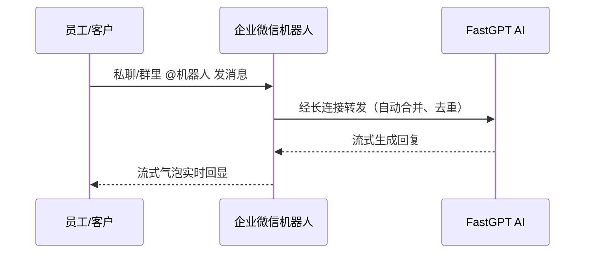

# 1. 企业微信 × FastGPT 连接器

> 企业微信是连接员工与客户的主阵地，很多人一天到晚都挂在上面。AI 如果也能「住进」企业微信，员工和客户就能在熟悉的对话里直接问 AI，不用切工具、不用重新登录。
> 企业微信连接器把 FastGPT 变成企业微信里的智能机器人：对话以流式气泡实时回显，支持文字、图片、图文混排、语音、视频；连续追问有上下文记忆，用推理模型时还能看到它的「思考过程」。
> 长连接接入，无需回调 URL、无需 nginx、无需手动管进程；消息自动合并去重，省 token 更省钱，Docker 一条命令即可上线。

> 【插图占位：企业微信机器人对话界面】
> 图片类型：界面截图
> 图片内容：企业微信里用户 @机器人 提问，AI 以流式气泡实时回显，同屏展示发图片/引用消息提问的场景
> 获取方式：截图——企业微信里与智能机器人对话，截「提问 + 流式气泡回复」同屏画面，涉及信息打码

---

## 一、为什么把 AI 装进企业微信

### 1.1 员工在哪，AI 就该在哪

企业微信不只是内部协作工具，更是很多企业对外连接客户的主阵地。把 AI 装进企业微信，等于让 AI 同时出现在**员工与客户的日常对话里**——对内答疑提效，对外触达更近。

- **零学习成本**：员工与客户都会用微信/企业微信，几乎不需要教学；
- **双场景复用**：同一套 AI 能力，既服务内部员工，也能服务外部触达；
- **全员可用**：不挑岗位、不挑技术背景，会用企业微信就会用 AI。

### 1.2 现状痛点

| 现象 | 影响 | 根因 |
|------|------|------|
| AI 在独立网页里，入口分散 | 切换工具、重复登录，使用率低 | AI 入口与企微日常入口割裂 |
| 多人轮流提问、请求频繁 | token 浪费、成本上升 | 逐条消息都单独发起一次 AI 请求 |
| 发图发文件发语音要另找地方 | 多模态问题不便提问 | 入口不支持直接发资源 |
| 传统接入要公网回调、配 nginx | 中小企业没公网资源，门槛高 | Webhook 模式依赖公网环境 |

### 1.3 适用条件

- 已经或准备用企业微信作为协作/客户触达入口；
- 已有 FastGPT 应用（或希望我们协助搭建）；
- 希望**员工与客户**都能低门槛用上 AI；
- 对数据安全有要求，希望对话数据留在自有内网。

---

## 二、上手体验：一次对话长这样

### 2.1 核心能力一览

| 能力 | 你能得到什么 |
|------|------------|
| **流式气泡** | 回复实时逐字推送，顺畅不卡顿，不用干等 |
| **多模态理解** | 文字、图片、图文混排、语音、视频都能交给 AI 理解 |
| **消息合并** | 同一会话内的连续消息自动合并为一次请求，省 token、省成本 |
| **多轮对话** | 记住上下文，`/clear`（或 `/c`）重开新话题 |
| **推理过程展示** | 用推理模型时，能看到 AI 的「思考过程」，更可信 |
| **欢迎卡片与按钮** | 进入会话自动欢迎，支持卡片按钮交互 |

---

## 三、为什么选它：四个「不折腾」

### 3.1 长连接接入，不折腾公网

无需配置回调 URL、无需 nginx、无需手动管理进程。服务通过**长连接通道**主动接入企业微信，内网即可运行。

### 3.2 开箱即用，不折腾代码

**拉镜像 → 填几个环境变量 → 启动**，一行代码不用写。流式气泡、多模态、消息合并这些体验细节全部内置。

### 3.3 消息合并去重，不折腾成本

同一会话 400ms 内的连续消息会合并成一次 AI 请求，配合消息去重与频率限制，**省 token、省模型调用成本**，用得越多越划算。

### 3.4 稳定防护 + 私有化，不折腾心智

自动鉴权、心跳、断线无限重连，配合消息去重与限流，服务稳定不易挂；同时私有化部署，数据**不出内网**，满足合规审计。

---

## 四、三步上线

| 步骤 | 动作 | 预期 |
|------|------|------|
| ① 准备机器人 | 在企业微信管理后台创建智能机器人（API 模式 · 长连接），约 10 分钟 | 拿到机器人凭据 |
| ② 部署服务 | Docker 一条命令拉起连接器（可提供镜像，或协助部署） | 服务在内网运行 |
| ③ 连上 FastGPT | 填入 FastGPT 应用信息，上线机器人 | 员工/客户在企微里直接对话 AI |

### 常见疑问

- **需要公网服务器吗？** 不需要。长连接模式无需回调 URL，内网即可跑。
- **发语音/视频 AI 能看懂吗？** 能。语音、视频、图片、文件都会转成 AI 能理解的形式。
- **会突然失灵吗？** 不会。断线自动重连、消息去重、限流兜底，服务稳定。
- **成本会不会越用越高？** 消息合并 + 去重能有效减少无效请求，控制模型调用成本。

---

## 五、下一步

> 与其看文字描述，不如在你们自己的企业微信里试一次：用已有的 FastGPT 应用接上企业微信机器人，几分钟就能看到流式气泡的真实效果。
> 点击页面右侧「预约免费 POC」，我们基于你的真实场景跑通一条对话链路，用效果说话。
