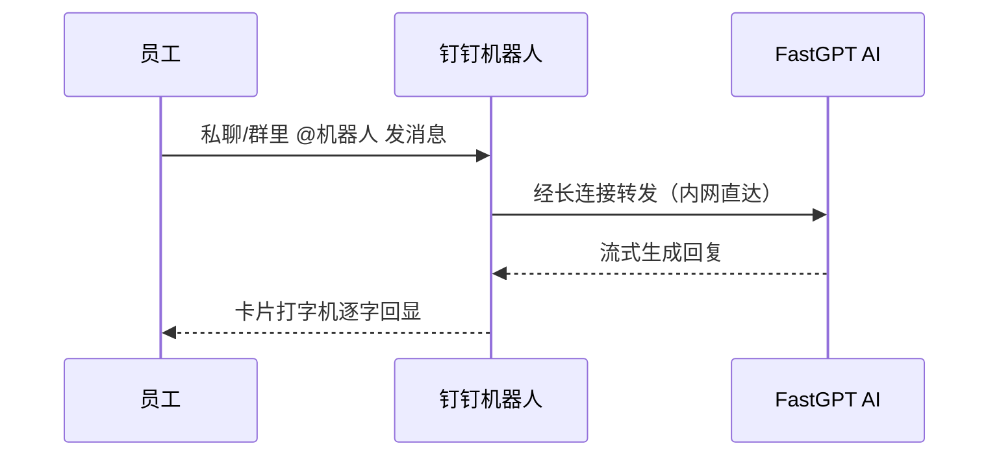

# 3. 钉钉 × FastGPT 连接器

> 员工的一天从钉钉开始、也几乎在钉钉里结束——打卡、审批、群聊、待办，全在这里。可当他们想用 AI 问个问题时，却要切到另一个网页，登录、找入口、重新组织语言，用完就忘。
> 钉钉连接器把 FastGPT 直接变成钉钉里的一个机器人：员工在熟悉的聊天窗口里 @机器人 或私聊提问，AI 以「卡片打字机」效果逐字作答，还能直接发图片、发文件让它看懂。
> 长连接接入，无需公网 IP、无需回调地址、无需配置 nginx；一条 Docker 命令拉起服务，几分钟内全员就能在钉钉里用上 AI。

> 【插图占位：钉钉机器人对话界面】
> 图片类型：界面截图
> 图片内容：钉钉聊天窗口里员工发问，右侧 AI 卡片正在逐字输出回答，同屏展示发图片问 AI 的场景
> 获取方式：截图——钉钉里与机器人对话，截「提问 + 卡片打字机回复」同屏画面，涉及信息打码

---

## 一、为什么把 AI 装进钉钉

### 1.1 员工在哪，AI 就该在哪

AI 落地的最大障碍，往往不是模型不够强，而是**入口不在员工手边**。一个藏在独立网页里的 AI 助手，无论多聪明，员工都要「想起来去用、切过去、重新登录」，使用率自然上不去。

钉钉是企业内部协作的高频入口，把它变成 AI 的入口，意味着：

- **零学习成本**：员工不用下载新 App、不用记新账号，在每天都会打开的钉钉里顺手提问；
- **零流程割裂**：问题、答案、上下文都留在工作群里，随手 @ 一下就能继续；
- **全员可用**：不需要技术背景，会用钉钉就会用 AI。

### 1.2 现状痛点

| 现象 | 影响 | 根因 |
|------|------|------|
| AI 在独立的网页/系统里 | 员工要切换工具、重新登录，使用率低 | AI 入口与员工日常入口割裂 |
| 等结果像「等整段生成」 | 没有流式反馈，体验生硬、误以为卡死 | 传统接入一次性回传，无打字机效果 |
| 发图片/文件要另找地方上传 | 想用多模态却不知道怎么给 AI 看 | 入口不支持直接发图、发文件 |
| 部署要公网回调、配域名 | 中小企业没公网资源，接入门槛高 | 传统 Webhook 模式依赖公网环境 |

四类痛点指向同一个结论：**AI 要真正用起来，就要「住在」员工已经在用的 IM 里，并且接入这件事本身不能折腾**。下面的方案正是从这两点出发。

### 1.3 适用条件

本连接器适合具备以下条件的组织，条件越充分、见效越快：

- 已经或准备用钉钉作为内部协作入口；
- 已有 FastGPT 应用（或希望我们协助搭建一个）；
- 希望**全员低门槛**使用 AI，而不是只让少数技术骨干用；
- 对数据安全有要求，希望对话数据留在自有内网。

---

## 二、上手体验：一次对话长这样

员工在钉钉里问 AI，整条链路不需要任何人切换工具：

### 2.1 核心能力一览

| 能力 | 你能得到什么 |
|------|------------|
| **流式卡片** | 像真人打字一样逐字回显，不用干等一整段，答到一半也能先看思路 |
| **多模态理解** | 直接发图片、发文件，AI 看得懂、答得上，不用先转成文字 |
| **多轮对话** | 记住上下文，追问不必重说背景；`/clear` 一键重开新话题 |
| **群聊支持** | 群里 @机器人 也能用，单聊、群聊两种场域都覆盖 |
| **稳定兜底** | 网络或卡片异常时自动降级为普通文本回复，服务不中断 |

---

## 三、为什么选它：四个「不折腾」

### 3.1 长连接接入，不折腾公网

传统机器人接入通常走 Webhook：要公网 IP 或域名、配回调地址、装 nginx、做证书——对没有专职运维的中小企业是一道硬门槛。

本连接器走钉钉官方 **Stream 长连接模式**，由服务主动连到钉钉，**无需任何公网资源，内网即可运行**。这意味着接入这件事，从「要 IT 折腾半天」变成「一条命令的事」。

### 3.2 开箱即用，不折腾代码

卡片打字机、多模态、多轮对话、降级兜底……这些体验细节全部内置好了。**拉镜像 → 填几个配置项 → 运行**，无需写一行代码。

### 3.3 私有化部署，不折腾合规

服务部署在你们自己的内网，员工的对话内容与上传的文件**不出内网**，满足数据合规与审计要求。AI 能力与数据自主，可以兼得。

### 3.4 智能降级，不折腾心智

即便卡片权限没配好或网络抖动，也会**自动退回普通文本回复**，不会「突然失灵」。用的人不需要关心背后的技术状态，AI 一直都在。

---

## 四、三步上线

| 步骤 | 动作 | 预期 |
|------|------|------|
| ① 准备机器人 | 在钉钉开发者后台创建机器人应用（有官方指引，约 10 分钟） | 拿到接入凭据 |
| ② 部署服务 | Docker 一条命令拉起连接器（可提供镜像，或协助部署） | 服务在内网运行 |
| ③ 连上 FastGPT | 填入 FastGPT 应用信息，发布机器人 | 员工在钉钉里直接对话 AI |

### 常见疑问

- **需要公网服务器吗？** 不需要。长连接模式下无公网 IP/域名也能跑，内网即可。
- **发文件 AI 能看懂吗？** 能。图片、文件会转成链接交给 FastGPT 理解，直接发就行。
- **会突然失灵吗？** 不会。自动重连 + 降级兜底，异常时退回普通文本，对话不断。
- **能多人同时用吗？** 能。按钉钉用户分别维护上下文，互不串话。

---

## 五、下一步

> 与其看文字描述，不如在你们自己的钉钉里试一次：用你已有的 FastGPT 应用（或我们帮你搭一个），接上钉钉机器人，几分钟就能看到「卡片打字机」的真实效果。
> 点击页面右侧「预约免费 POC」，我们基于你的真实场景跑通一条对话链路，用效果说话。
