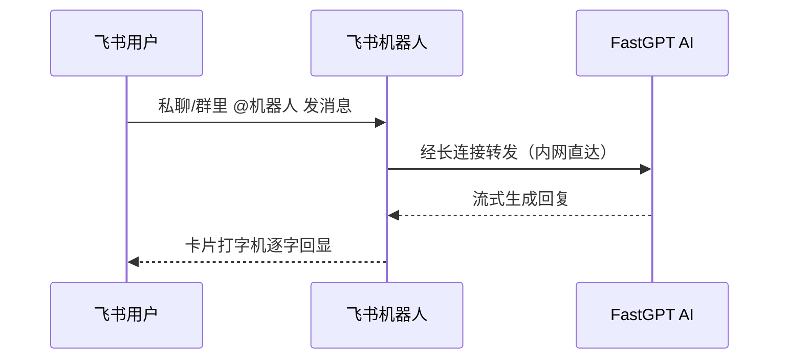

# 2. 飞书 × FastGPT 连接器

> 飞书承载了文档、会议、消息、审批一整套协作，员工对它的打开率几乎是最高的。可 AI 助手却常常「住」在另一个网页里，需要时找不到，找到也不方便。
> 飞书连接器把 FastGPT 变成飞书里的一个机器人：私聊或群里 @机器人 提问，AI 以卡片打字机效果逐字作答；发图片、发文件它都看得懂，新用户第一次进来还会自动收到一张欢迎卡片。
> 飞书长连接（WebSocket）接入，无需公网回调地址、无需 Webhook、无需 nginx，服务可跑在内网；Docker 拉镜像即用，填几个配置项即可上线。

> 【插图占位：飞书机器人对话界面】
> 图片类型：界面截图
> 图片内容：飞书聊天窗口里用户首次进入机器人会话收到欢迎卡片，提问后卡片逐字流式回复
> 获取方式：截图——飞书里与机器人对话，截「欢迎卡片 + 卡片打字机回复」同屏画面，涉及信息打码

---

## 一、为什么把 AI 装进飞书

### 1.1 员工在哪，AI 就该在哪

飞书是很多团队「一天都泡在里面」的地方。AI 如果不在这个入口里，就会被一个独立的网页版边缘化——再聪明，员工也想不起来用。

把 AI 装进飞书，本质上是**把 AI 放进员工现有的工作流**，而不是让他们为 AI 再学一套新东西：

- **零学习成本**：在熟悉的聊天窗口里 @机器人 就能问，没有新工具、新账号；
- **上下文自然**：问题、答案、追问都留在对话流里，随时翻、随时续；
- **全员可用**：不挑岗位、不挑技术背景，会用飞书就会用 AI。

### 1.2 现状痛点

| 现象 | 影响 | 根因 |
|------|------|------|
| AI 在独立网页里，入口分散 | 员工切换工具、重复登录，使用率低 | AI 入口与飞书日常入口割裂 |
| 新用户进来不知怎么开始 | 冷启动差，第一次体验就劝退 | 缺少欢迎引导 |
| 发图发文件要另找地方 | 多模态问题不便提问 | 入口不支持直接发资源 |
| 传统接入要公网回调 | 中小企业没有公网资源，门槛高 | Webhook 模式依赖公网 |

四类痛点指向同一个结论：**AI 要真正用起来，就要「住在」员工已经在用的飞书里，而且接入这件事本身不能折腾**。

### 1.3 适用条件

- 已经或准备用飞书作为内部协作入口；
- 已有 FastGPT 应用（或希望我们协助搭建）；
- 希望**全员低门槛**使用 AI；
- 对数据安全有要求，希望对话数据留在自有内网。

---

## 二、上手体验：一次对话长这样

### 2.1 核心能力一览

| 能力 | 你能得到什么 |
|------|------------|
| **欢迎卡片** | 用户第一次进入会话自动收到引导卡片，冷启动不再靠猜 |
| **卡片流式回复** | 逐字回显，像真人打字，不用干等一整段 |
| **多模态理解** | 发图片、发文件，AI 直接看懂作答 |
| **全消息类型覆盖** | 文本、富文本、图片、文件、位置、任务、投票等都能正确处理 |
| **多轮对话** | 记住上下文，`/clear`（或 `/c`、`/0`）重开新话题 |
| **群聊响应策略** | 默认只响应 @机器人 的消息，不打扰、不刷屏 |

---

## 三、为什么选它：四个「不折腾」

### 3.1 长连接接入，不折腾公网

传统飞书机器人接入要配公网回调地址、装 Webhook、做证书。本连接器走飞书**长连接（WebSocket）**，由服务主动连到飞书，**无需公网回调地址、无需 Webhook、无需 nginx，内网即可运行**。

### 3.2 开箱即用，不折腾代码

提供现成的 Docker 镜像，**拉镜像 → 填环境变量 → 运行**，一行代码都不用写。欢迎卡片、流式回复、多模态、多轮对话这些细节全部内置。

### 3.3 全消息类型，不折腾场景

不只是「发文字问一句」，从图片、文件到位置、任务、投票，飞书里常见的内容形态都做了适配——AI 能接住的不只是聊天，还有各种业务场景的输入。

### 3.4 私有化部署，不折腾合规

服务部署在自有内网，对话内容与上传文件**不出内网**，数据自主、满足合规审计。

---

## 四、三步上线

| 步骤 | 动作 | 预期 |
|------|------|------|
| ① 准备机器人 | 在飞书开放平台创建企业自建应用、开通机器人能力（官方指引，约 10 分钟） | 拿到应用凭据 |
| ② 部署服务 | Docker 一条命令拉起连接器（可提供镜像，或协助部署） | 服务在内网运行 |
| ③ 连上 FastGPT | 填入 FastGPT 应用信息，发布应用 | 员工在飞书里直接对话 AI |

### 常见疑问

- **需要公网服务器吗？** 不需要。长连接模式无需公网回调地址，内网即可跑。
- **发文件 AI 能看懂吗？** 能。内置文件服务会把资源转成链接交给 FastGPT 理解。
- **群里会刷屏吗？** 不会。默认只响应 @机器人 的消息，也可按需配置响应策略。
- **会突然失灵吗？** 不会。容器内置健康检查，启动即有自检，异常可快速定位。

---

## 五、下一步

> 与其看文字描述，不如在你们自己的飞书里试一次：用已有的 FastGPT 应用接上飞书机器人，几分钟就能看到欢迎卡片 + 打字机回复的真实效果。
> 点击页面右侧「预约免费 POC」，我们基于你的真实场景跑通一条对话链路，用效果说话。
