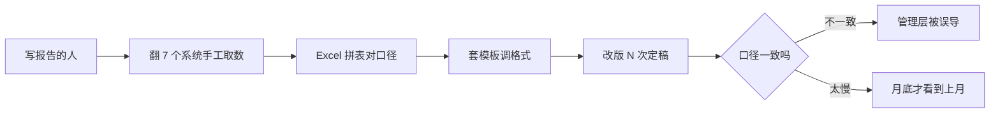

# AI 报告生成

> 一份经营分析报告，从周三开始要、周五才交出来——不是写的人偷懒，是数据散在 7 个系统里，取数要半天、对口径要半天、调格式再半天。
> FastGPT 把「取数、口径、排版」三件最耗时的活交给规则：一句话说清要哪块、什么周期、什么维度，AI 自动从 ERP/CRM/BI 拉数、按企业模板生成、口径由规则统一，人只做最后的判断。
> 某连锁零售企业运营中心上线后，单份报告撰写耗时从平均 3-5 小时降到 15-30 分钟，口径不再各写各的，管理层从「月底才看到上月」变成「随时看最新口径」，预计 5-8 个月回本。

> 【插图占位：报告生成对话界面】
> 图片类型：界面截图
> 图片内容：运营一句话「生成华东区上月经营周报」，AI 返回自动取数后生成的报告草稿，数据来源与口径标注清晰
> 获取方式：截图——FastGPT 应用 → 调试预览，输入一段报告生成指令并触发取数，截「指令 + 生成报告草稿」同屏画面，涉及数据打码

---

## 一、场景洞察与痛点

### 1.1 为什么报告生成值得做 AI

报告的真正卡点，几乎从来不在「写」这个动作本身，而在它前面被严重低估的三件脏活：**取数、对口径、调格式**。多数企业不是没有系统——BI、ERP、OA 早就铺了一堆——而是**这些系统只承载了「数据在哪」，没解决「数据怎么拼成一份报告」**：指标口径散落在不同部门各自的 Excel 里、每次取数都要人工去翻七八个系统、排版靠一份老模板复制粘贴改十版。于是报告的价值链条断裂在「最后一公里」：管理层想看的不是原始数据，而是一个口径统一、结论清楚的经营判断，但把原始数据变成这个判断的过程，全都压在写报告的人身上。这正是 AI 能补上的空位——**把「取数、口径、排版」交给规则，把「读数据、下判断、给建议」留给写报告的人**。

### 1.2 共性痛点因链

| 现象 | 影响谁 | 根因 |
|------|--------|------|
| 取数要翻多个系统、手工导出拼表 | 写报告的人耗时、易错 | 数据散在 ERP/CRM/BI，没有统一出口 |
| 指标口径各写各的、对不上 | 管理层对比难、被误导 | 口径靠人记，没有统一规则 |
| 排版复制粘贴、改十版才定稿 | 写报告的人返工、出品慢 | 模板靠手工套用，无结构化复用 |
| 报告滞后、月底才看到上月 | 管理层决策延误 | 取数排版费时，跟不上业务节奏 |

四大根因不是孤立的，而是层层递进的同一条链：**取数靠手工 → 口径靠人记 → 排版靠复制 → 交付靠熬夜**。前面一环卡住，后面一环只会更慢。下面第二章的每个模块，都对着这条链上的一个结下手，把「靠人」换成「靠规则」。

### 1.3 适用条件

本方案适合具备以下条件的组织，条件越充分、收益越显著：

- 有规范的报告体系（周报 / 月报 / 经营分析）与相对固定的模板和口径；
- 数据已经沉淀在 ERP / CRM / BI / 数据仓库中，而非散落在手工 Excel；
- 月均报告量达到数十份以上，AI 的取数与生成能力才有规模收益；
- 员工已在使用企业微信 / 钉钉 / 飞书 / 邮件等入口（降低采用门槛）；
- 有明确的数据口径责任方（AI 不替管理层拍板，必须有人对口径负责）。

> 若数据还在 Excel 里手工维护、口径尚未统一，建议先梳理数据源与指标口径再启动智能化——这也是对客户负责的做法。

---

## 二、解决方案设计

### 2.1 总体蓝图

先看现状——报告在「翻系统、拼表、调格式」里打转，断点全卡在「靠人」：



接入 FastGPT 后，同一套取数与生成流程把断点逐个接上：


> 【插图占位：报告生成业务架构图】
> 图片类型：架构图
> 图片内容：数据源（ERP/CRM/BI/数据仓库）→ 能力层（取数/口径规则/模板生成）→ 渠道层（企微/钉钉/飞书/邮件/Web）四层纵向
> 获取方式：制图——Mermaid 画四层纵向分层图，每层标注职责

### 2.2 多渠道 × 多系统覆盖

同一套取数与生成流程在背后复用，写报告的人从哪个入口进来都能生成：

| 入口/系统 | 接入方式 | 场景 |
|------|------|------|
| 企业微信 / 钉钉 / 飞书机器人 | OpenAPI 接入 | 群聊里一句话要一份周报、定时推送月报 |
| 邮件 / Web 免登录窗口 / 门户 | 定时任务 / 分享链接 / iframe | 管理层订阅式收报告、团队统一入口 |
| 小程序 / APP / 自研系统 | API 接入 | 业务后端、员工自助查询经营数据 |
| ERP / CRM / BI / 数据仓库 | API / 插件对接 | 取数的数据源，报告自动拉数 |

> 两个维度分开看，缺一不可：**渠道**是「人从哪进来生成」（IM、邮件、Web、API），解决报告的出口；**系统**是「AI 接谁的数据」（ERP、CRM、BI、数仓），解决报告的原料。只有渠道没有系统，方案就成了「只有前台没有后台」的聊天框；只有系统没有渠道，写报告的人又不知道从哪进。

落到一个具体画面：运营在飞书群里 @机器人 要一份华东区上月周报、管理层在邮件里定时收到自动生成的月报、报告的数据经 BI 接口自动拉取——两个入口、两套后端，背后是同一套取数与口径流程。

### 2.3 痛点一一对应解决（因果闭环）

四个模块不是功能堆叠，而是一条链：**自动取数 → 口径规则引擎 → 模板套用 → 定时分发**。每个模块都在消灭一个具体痛点，落地后变成一个可观察的结果：

| 客户痛点（脱敏） | 方案模块 | 落地后的结果 |
|------|---------|------------|
| 取数要翻多个系统、手工导出拼表 | ① 自动取数 | 一句话触发，ERP/CRM/BI 自动拉数，不再手工拼表 |
| 口径各写各的、对不上 | ② 口径规则引擎 | 指标定义统一入库，报告口径一致 |
| 排版复制粘贴、改十版 | ③ 模板套用 + 结构化生成 | 单份撰写约 3-5 小时 → 15-30 分钟 |
| 报告滞后、月底才看到上月 | ④ 定时 + 订阅式分发 | 按时生成推送，管理层随时看最新口径 |

**设计原则：AI 不越权**——取数只做自动对接、不臆造口径；口径冲突的字段标黄交人工核验、不擅自定夺；生成只出草稿与出处、发布权始终在人；数据解读只做建议、不替管理层拍板。

### 2.4 长尾与边界场景（枚举四问）

主流程之外，主动把复杂场景点出来，证明方案经得起生产追问：

1. **口径/规则异常**：多口径冲突、同比基期缺失、多币种、跨部门分摊——AI 给出口径建议，冲突字段标黄交人工核验，不做自动判定。
2. **数据/凭证异常**：缺字段、数据延迟、重复取数、口径冲突——不确定字段标黄补填，重复项按指标/周期比对历史拦截。
3. **权限/合规异常**：敏感经营数据、越权访问、审计留痕——经营数据留在内网，按角色控可见，关键操作全程留痕可追溯。
4. **流程/系统异常**：接口超时、取数失败、并发峰值、人工介入点——异常自动标注原因转人工，失败可重试并留痕。

**能主动写出「哪些环节仍需人工」，是这套方案成熟度的标志。**

### 2.5 人机分工总表

| 环节 | AI 全自动 | AI 生成 + 人工确认 | 人工主导 |
|------|:---:|:---:|:---:|
| 自动取数、口径匹配、模板生成 | ● | | |
| 定时生成与分发 | ● | | |
| 口径核验、异常标注 | | ● | |
| 分析结论与业务解读 | | ● | |
| 最终发布与决策 | | | ● |

这张表是整个方案的地基：**AI 负责「能自动执行的执行」，人负责「需要判断力的判断」**。客户对 AI 的信任，来自它知道自己不臆造口径、不替管理层拍板。

> 【插图占位：人机分工泳道图】
> 图片类型：人机分工图
> 图片内容：AI 全自动 / AI 生成+人工确认 / 人工主导 三列泳道，标出报告生成各环节落在哪一列
> 获取方式：制图——Mermaid 画三列泳道图，把上表各环节落到对应泳道

---

## 三、落地价值与收益

### 3.1 价值维度

| 维度 | 面向对象 | 价值主张 |
|------|---------|---------|
| 员工体验 | 写报告的人 | 不用翻系统拼表调格式，把时间还给「读数据、下判断」 |
| 决策效率 | 管理层 | 从「月底才看到上月」变为「随时看最新口径」 |
| 口径一致 | 全公司 | 指标定义统一，不再各写各的、对比失真 |
| 合规可信 | CFO、管理层 | 数据来源与口径可追溯，审计有据 |

### 3.2 量化框架（指标三件套）

每个数字都按「落地前 → 落地后 → 为什么变」交代因果，而非甩一个百分比：

| 价值维度 | 衡量口径 | 落地前 | 落地后 | 为什么变 |
|---------|---------|-------|-------|---------|
| 撰写效率 | 单份报告撰写耗时 | 平均约 3-5 小时 | 约 15-30 分钟 | 自动取数 + 模板套用 + 口径统一替代三件手工活 |
| 取数覆盖 | 取数自动完成率 | 手工翻多系统 | 约 95% 以上 | 数据源统一对接，存疑字段标黄交人工补填 |
| 口径一致 | 指标口径冲突率 | 各写各的、常对不上 | 规则统一入库 | 口径由规则引擎统一管理，不再靠人记 |
| 时效 | 报告交付周期 | 月底才出上月 | 按时自动推送 | 定时生成 + 订阅式分发，不依赖人工赶工 |

```echarts
{
  "title": { "text": "从现状到目标的撰写耗时拆解", "subtext": "每根柱子是一笔节省或投入，落到约 15-30 分钟", "left": "center" },
  "tooltip": { "trigger": "axis", "axisPointer": { "type": "shadow" } },
  "grid": { "left": "8%", "right": "6%", "top": "20%", "bottom": "8%", "containLabel": true },
  "xAxis": { "type": "category", "data": ["现状耗时", "自动取数", "模板套用", "口径统一", "人工复核", "目标耗时"] },
  "yAxis": { "type": "value", "name": "分钟", "nameLocation": "middle", "nameGap": 30 },
  "series": [
    { "type": "bar", "stack": "total", "name": "基线", "silent": true, "itemStyle": { "color": "transparent" }, "data": [0, 180, 90, 40, 20, 0] },
    { "type": "bar", "stack": "total", "name": "变化", "label": { "show": true, "position": "top" }, "data": [
      { "value": 180, "itemStyle": { "color": "neutral" } },
      { "value": -90, "itemStyle": { "color": "primary" } },
      { "value": -50, "itemStyle": { "color": "primary" } },
      { "value": -20, "itemStyle": { "color": "primary" } },
      { "value": 5, "itemStyle": { "color": "warning" } },
      { "value": 25, "itemStyle": { "color": "success" } }
    ] }
  ]
}
```

这张瀑布图把「从 3 小时现状落到 15-30 分钟」拆成一步步：自动取数省下约 90 分钟、模板套用省下约 50 分钟、口径统一省下约 20 分钟，人工复核回补约 5 分钟——最终落到目标耗时。它讲的是「省下的时间从哪来、又花到哪去」，而不是甩一个「效率提升 90%」的空数字。

### 3.3 ROI 与回本周期

「值不值」要算得出来：**回本周期 = 一次性投入 ÷ 月净收益**，公开场景用区间与百分比表达，不写绝对金额：

| 类别 | 构成 |
|------|------|
| 一次性投入 | 软件授权 / License、服务器或云资源、实施与集成、口径与模板冷启动、培训 |
| 持续性投入 | 模型调用 / API 费用、运维人力、口径与模板更新 |
| 收益（钱） | 人力节省：报告撰写从 3-5 小时降到 15-30 分钟释放的运营/财务人力、返工减少 |
| 收益（折算） | 决策提速带来的隐性价值、口径一致避免的误导与返工 |

> 某连锁零售企业运营中心脱敏参考：一次性投入主要为授权 + 实施 + 口径冷启动，月净收益来自撰写人力释放与返工减少，**预计 5-8 个月回本**；未计入决策提速的隐性价值，属保守估算。回本周期用区间表达、不承诺具体数值；正式交付时以企业自身数据实测为准，按月复测，用数据说话。

---

## 四、落地路径与运营

### 4.1 分阶段推进节奏

方案落地遵循「**先验证、再试点、后规模化**」，每阶段有明确动作和验收口径：

| 阶段 | 目标 | 典型动作 | 验收口径 |
|------|------|---------|---------|
| 验证 | 用真实样本证明核心链路可行 | 接数据源，用真实报告样本测取数准确率与生成质量 | 取数准确率、口径一致率达到约定口径 |
| 试点 | 在一个报告量大的部门真跑 | 运营/财务等部门上线，收集使用反馈 | 撰写耗时、取数自动完成率达到口径 |
| 规模化 | 全公司推广并接入业务系统 | 对接 ERP/CRM/BI 全量上线，覆盖全部门 | 全量运行，口径维护闭环建立，运营机制运转 |

> 具体周期和阈值视组织规模、数据条件与配合度调整；我们不承诺「一次上线、永久可用」，而是交付可持续运营的机制。

### 4.2 数据与规则冷启动

- 优先梳理**报告模板、指标口径、数据源映射**，这是取数与生成的地基；
- 先用小批量真实报告样本验证取数准确率与生成质量，再增量补充历史报告；
- 每批导入后人工抽检、纠错回流，避免「错的口径越滚越大」。

### 4.3 持续运营闭环

- **口径纠错回流**：口径冲突字段被人工纠正后，回流优化规则引擎；
- **模板迭代**：业务方补充新报告类型、修订旧模板，同步到生成流程；
- **效果复测**：按月复测撰写耗时、取数准确率，找出下滑原因；
- **规则更新**：口径制度修订后同步更新规则，杜绝「旧口径误导新报告」。

> 【插图占位：运营仪表板截图】
> 图片类型：界面截图
> 图片内容：报告生成量、取数准确率、撰写耗时的运营曲线
> 获取方式：截图——FastGPT 应用 → 数据统计，截运营仪表板，展示「越用越准」的复测闭环

---

## 五、选型价值与下一步

### 5.1 FastGPT 企业级价值（能力 → 证据 → 收益）

我们交付的不是一个工具，而是一套跑得通、控得住、越用越准的报告生成体系。它建立在这些企业级能力之上：

| 能力 | 证据 | 对报告场景的收益 |
|------|------|----------------|
| 私有化部署，数据自控 | 系统部署在企业内网 | 经营与口径数据不出网，满足财务合规与审计要求 |
| OpenAPI 完整开放 | 兼容 OpenAI 接口格式 | 对接企微/钉钉/飞书/邮件/ERP/BI，AI 嵌入现有工作入口 |
| 模型无关 | 可切换 DeepSeek/通义千问/GLM 等 | 不被单一模型供应商绑定，随时选性价比最优 |
| 零代码可视化编排 | 现有 IT 团队拖拽搭建 | 从零到上线约 4-6 周，无需招聘 AI 工程师 |
| 免费 POC 概念验证 | 针对真实场景搭建验证 | 用企业真实报告样本实测后再决策采购，零风险试用 |

### 5.2 选型顾虑回应

- **对比商业 BI/报告 SaaS**：SaaS 多为按席位收费、数据在第三方、口径难以深度定制；本方案私有化部署、口径可按企业规则持续迭代，更适合对数据自主与口径一致要求高的组织。
- **对比自研方案**：自研需要 AI 工程师与数月研发周期；本方案基于成熟底座与可视化编排，由现有 IT 团队在数周内落地。
- **对比通用 AI 助手**：通用助手缺系统对接与口径规则；本方案内置自动取数、口径规则引擎，并与 ERP/BI 系统打通。

### 5.3 预约免费 POC

> 如需进一步验证，点击页面右侧「预约免费 POC」，用企业自身的报告模板、数据源与口径规则，实测取数准确率与撰写耗时，用数据验证前文落地效果。
