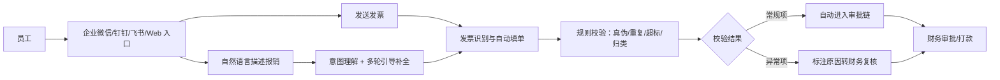

# AI 智能报销

> 一张 1500 块的酒店发票，从员工手里到钱回到卡上，要走一段不短的路：拍下来 → 逐字段手填一张单 → 财务逐单人工核对标准 → 审批 → 打款。每一步都在「靠人」——靠人填、靠人记、靠人查，卡点全在这条路上。
> FastGPT 提供一套端到端的费用报销智能化方案——自然语言报销、发票识别、自动填单、全量规则校验、人工例外复核，覆盖企业微信、钉钉、飞书、泛微 OA 等入口，帮企业把员工从逐字段手工填单里解放出来，把财务团队从重复劳动里释放出来，把合规从「抽查碰运气」升级为「全量兜底」。
> 某连锁零售企业财务中心上线后，单张报销单填单耗时从平均 3 分钟降到 1 分钟以内，财务审核从「逐单全审」转为「只审被标记的异常单」，异常拦截覆盖从人工抽查变为全量必查，预计 6-9 个月回本。


> 【插图占位：报销助手对话界面】
> 图片类型：界面截图
> 图片内容：员工一句话描述「上周出差北京三天，酒店 1500 已开票」，AI 返回识别出的发票要素 + 自动填好的单据草稿同框
> 获取方式：截图——FastGPT 应用 → 调试预览，输入一段自然语言报销描述并上传发票，截「识别 + 自动填单」同屏画面，涉及数据打码

---

## 一、场景洞察与痛点

### 1.1 为什么费用报销值得做 AI

费用报销几乎人人参与、月月发生，却长期处于「低效率、高摩擦、低透明」的状态。多数企业不是没有系统——大多上了 OA 或财务系统——而是**系统只承载了流程，没解决「理解」和「判断」的问题**：员工要说清楚这笔钱花在哪、把每一个字段都填对，发票信息靠一张张手敲，是否符合标准靠财务人肉核对。这正是 AI 能补上的空位——让员工用一句话、一张发票就能发起报销，把「判断」交给规则、把「录入」交给识别。

### 1.2 共性痛点因链

| 现象 | 影响谁 | 根因 |
|------|--------|------|
| 填单慢、常被打回重填 | 员工垫资久、体验差；财务返工 | 发票信息靠手填，逐字段录入费时易错 |
| 财务逐单人工审核、翻标准 | 财务加班、出错、被审计挑战 | 超标、归类、真伪全靠人肉记忆判断 |
| 报销合规风险 | 财务负责人、管理层 | 重复报销、超标、虚假发票靠人工抽查，必有漏 |

三大根因层层递进：**填单人工 → 审核靠人肉 → 流程黑盒**。解决方案的全部模块都从这里长出来——下面第二章会逐一对应消灭，不留悬空痛点。

### 1.3 适用条件

本方案适合具备以下条件的组织，条件越充分、收益越显著：

- 有较规范的报销制度和审批流（制度是规则校验引擎的原料）；
- 报销量达到一定规模（月均数百单以上，AI 才有规模收益）；
- 员工已在使用企业微信 / 钉钉 / 飞书等办公入口（降低采用门槛）；
- 有明确的财务复核责任方（AI 不替财务做主，必须有人兜底）。

> 若报销量极小、制度尚不健全，建议先补齐制度与流程再启动智能化——这也是对客户负责的做法。

---

## 二、解决方案设计

### 2.1 总体蓝图

先看现状——断点都卡在「靠人、靠记忆、靠抽查」上：


接入 FastGPT 后，同一套识别与校验流程把断点逐个接上：



> 【插图占位：报销助手业务架构图】
> 图片类型：架构图
> 图片内容：数据源（发票/报销规则/差旅审批）→ 能力层（意图理解/识别/校验）→ 渠道层（企微/钉钉/飞书/OA/Web）四层纵向
> 获取方式：制图——Mermaid 画四层纵向分层图，每层标注职责

### 2.2 多渠道 × 多系统覆盖

同一套识别与校验流程在背后复用，员工从哪个入口进来都能报：

| 入口/系统 | 接入方式 | 场景 |
|------|------|------|
| 企业微信 / 钉钉 / 飞书机器人 | OpenAPI 接入 | 内部协作、群聊里一句话发起报销 |
| 微信公众号 / 微信个人号 | API / ClawBot | 私域触达、移动端上传发票报销 |
| 小程序 / APP / 自研系统 | API 接入 | 业务后端、员工自助端 |
| Web 免登录窗口 / 门户 | 分享链接 / iframe / 登录门户 | 团队统一入口、员工自助报销 |
| 泛微 OA / ERP / CRM / 财务 / 工单 | API / 插件对接 | 审批、报销、合同、数据查询 |

> 两个维度分开看，缺一不可：**渠道**是「用户从哪进来报销」（IM、微信、自有端、Web、API），解决入口覆盖；**系统**是「AI 要接谁的后端」（OA、ERP、CRM、财务、工单），解决业务打通。只有渠道没有系统，方案就成了「只有前台没有后台」的聊天框；只有系统没有渠道，员工又不知道从哪进。

落到一个具体画面：员工在飞书群里 @机器人 一句话发起差旅报销、在公众号上传发票自动填单，报销单据经泛微 OA 发起、由财务系统打款——两个入口、两套后端，背后是同一套识别与校验流程。

### 2.3 痛点一一对应解决（因果闭环）

四个模块不是功能堆叠，而是一条链：**自然语言报销 → 发票自动填单 → 全量校验 → 人工例外裁决**。每个模块都在消灭一个具体痛点，落地后变成一个可观察的结果：

| 客户痛点（脱敏） | 方案模块 | 落地后的结果 |
|------|---------|------------|
| 员工要逐字段手填、不会填、常被打回 | ① 自然语言报销 | 一句话说清要报什么，AI 理解意图并引导补全要素 |
| 发票要素靠手敲、识别易错 | ② 发票识别 + 自动填单 | 发一张发票自动提取要素，单张填单约 3 分钟 → 1 分钟以内 |
| 财务逐单全审、翻标准靠记忆 | ③ 规则校验引擎 | 财务从逐单全审转为只审被标记的异常单 |
| 重复/超标/疑似虚假靠抽查、流程黑盒 | ④ 全量校验 + 流程透明 | 违规拦截从抽查变全量必查，进度可查 |

**设计原则：AI 不越权**——自然语言理解只做意图澄清与要素补全、不替员工臆造金额；识别不确定的字段标黄交员工补填、不臆造；校验只出结论与原因、最终裁决权始终在财务；差旅关联只做建议与提醒、不替代审批决策。

### 2.4 长尾与边界场景（枚举四问）

主流程之外，主动把复杂场景点出来，证明方案经得起生产追问：

1. **金额/数量异常**：多币种、跨部门分摊、红冲退款、超额、批量提交——AI 给出识别与归类建议，金额裁决交财务复核，不做自动判定。
2. **数据/凭证异常**：缺字段、识别不确定、口径冲突、重复提交——不确定字段标黄由员工补填，重复项按发票号/金额/日期比对历史拦截。
3. **权限/合规异常**：敏感数据、越权、审计留痕、合规否决——票据与费用数据留在内网，关键操作全程留痕可追溯。
4. **流程/系统异常**：接口超时、回调失败、并发峰值、人工介入点——异常单自动标注原因转人工，接口失败可重试并留痕。

**能主动写出「哪些地方仍需人工」，是这套方案成熟度的标志。**

### 2.5 人机分工总表

| 环节 | AI 全自动 | AI 生成 + 人工确认 | 人工主导 |
|------|:---:|:---:|:---:|
| 自然语言意图理解、要素补全引导 | ● | | |
| 发票要素识别、归类建议 | ● | | |
| 真伪/重复/超标/归类校验 | ● | | |
| 差旅关联出差审批 | | ● | |
| 异常项复核与裁决 | | | ● |
| 打款 | | | ● |
| 制度制定与更新 | | | ● |

这张表是整个方案的地基：**AI 负责「能自动判定的判定」，人负责「需要判断力的裁决」**。客户对 AI 的信任，来自它知道自己不管钱、不拍板。

> 【插图占位：人机分工泳道图】
> 图片类型：人机分工图
> 图片内容：AI 全自动 / AI 生成+人工确认 / 人工主导 三列泳道，标出报销流程各环节落在哪一列
> 获取方式：制图——Mermaid 画三列泳道图，把上表各环节落到对应泳道

---

## 三、落地价值与收益

### 3.1 价值维度

| 维度 | 面向对象 | 价值主张 |
|------|---------|---------|
| 员工体验 | 全员 | 填单快、到账快、不用逐字段手敲 |
| 财务效率 | 财务团队 | 从逐单全审转向只审异常 |
| 合规风险 | CFO、管理层 | 从抽查碰运气变为全量兜底，有规则、有留痕 |
| 费用透明 | 管理层 | 费用结构、预算使用实时可见 |

### 3.2 量化框架（指标三件套）

每个数字都按「落地前 → 落地后 → 为什么变」交代因果，而非甩一个百分比：

| 价值维度 | 衡量口径 | 落地前 | 落地后 | 为什么变 |
|---------|---------|-------|-------|---------|
| 填单效率 | 单张报销单填单耗时 | 平均约 3 分钟 | 约 1 分钟以内 | 发票识别 + 自动填单替代逐字段手工录入 |
| 识别准确率 | 发票要素自动识别准确率 | 手工录入 | 约 95% 以上 | 识别模型识别，不确定字段标黄交员工补填 |
| 审核效率 | 财务审单范围 | 逐单全审 | 只审被标记异常单 | 规则全量校验后人工只处理异常项 |
| 违规拦截 | 重复/超标/疑似虚假项拦截覆盖 | 人工抽查 | 全量必查 | 校验引擎对每一单都跑，不漏检 |

```echarts
{
  "title": {
    "text": "落地后财务审单工作量构成",
    "subtext": "从逐单全审变为只审约 15% 的异常单",
    "left": "center",
    "textStyle": { "fontSize": 15 },
    "subtextStyle": { "fontSize": 12 }
  },
  "tooltip": { "trigger": "item", "formatter": "{b}: {d}%" },
  "legend": { "bottom": 0 },
  "series": [
    {
      "type": "pie", "radius": ["42%", "68%"], "center": ["50%", "48%"],
      "label": { "formatter": "{b}\n{d}%" },
      "data": [
        { "value": 82, "name": "规则自动通过", "itemStyle": { "color": "primary" } },
        { "value": 13, "name": "异常单人工复核", "itemStyle": { "color": "warning" } },
        { "value": 5, "name": "制度/规则维护", "itemStyle": { "color": "neutral" } }
      ]
    }
  ]
}
```

这张环形图把「财务只审异常」这件事讲成一个可感的结果：约八成以上的报销单由规则全量校验后自动通过、不再占用财务逐单核对的人力，财务把精力收拢到约 15% 的异常单和规则维护上。这就是「审核效率」从逐单全审变为只审异常的可视化表达——不是甩一个「效率提升 80%」的空数字，而是把审单工作量到底怎么分配的构成画出来。

### 3.3 ROI 与回本周期

「值不值」要算得出来：**回本周期 = 一次性投入 ÷ 月净收益**，公开场景用区间与百分比表达，不写绝对金额：

| 类别 | 构成 |
|------|------|
| 一次性投入 | 软件授权 / License、服务器或云资源、实施与集成、规则冷启动、培训 |
| 持续性投入 | 模型调用 / API 费用、运维人力、规则更新 |
| 收益（钱） | 人力节省：财务审核从逐单全审转为只审异常、自动填单释放的员工与财务填单人力 |
| 收益（折算） | 违规全检避免的罚款与审计风险、员工到账变快带来的体验与垫资减少 |

> 某连锁零售企业财务中心脱敏参考：一次性投入主要为授权 + 实施 + 规则冷启动，月净收益来自财务审核人力释放与自动填单节省，**预计 6-9 个月回本**；未计入合规风险下降与员工体验提升，属保守估算。回本周期用区间表达、不承诺具体数值；正式交付时以企业自身数据实测为准，按月复测，用数据说话。

---

## 四、落地路径与运营

### 4.1 分阶段推进节奏

方案落地遵循「**先验证、再试点、后规模化**」，每阶段有明确动作和验收口径：

| 阶段 | 目标 | 典型动作 | 验收口径 |
|------|------|---------|---------|
| 验证 | 用真实样本证明核心链路可行 | 导入真实票据样本，测识别准确率、校验拦截率 | 各指标达到约定口径 |
| 试点 | 在一个报销量大的部门真跑 | 差旅多的部门（如销售）上线，收集使用反馈 | 填单耗时、识别准确率、审核效率达到口径 |
| 规模化 | 全公司推广并接入业务系统 | 对接 OA/ERP/资金系统，全量上线 | 全量运行，异常复核闭环，运营机制建立 |

> 具体周期和阈值视组织规模、数据条件与财务配合度调整；我们不承诺「一次上线、永久可用」，而是交付可持续运营的机制。

### 4.2 数据与规则冷启动

- 优先梳理**报销规则、差旅标准、归类规则**，这是校验引擎的地基；
- 先用小批量真实票据样本验证识别准确率，再增量补充历史报销单与财务判例；
- 每批导入后人工抽检，纠错后回流，避免「错的数据越滚越大」。

### 4.3 持续运营闭环

- **识别纠错回流**：识别不确定的字段被员工纠正后，回流优化识别模型；
- **规则迭代**：财务补充新规则、修订旧规则，同步到校验引擎；
- **效果复测**：按月复测识别准确率、拦截率，找出下滑原因；
- **规则更新**：制度修订后同步更新校验规则，杜绝「旧规则误导」。

> 【插图占位：运营仪表板截图】
> 图片类型：界面截图
> 图片内容：调用量、识别准确率、违规拦截率的运营曲线
> 获取方式：截图——FastGPT 应用 → 数据统计，截运营仪表板，展示「越用越准」的复测闭环

---

## 五、选型价值与下一步

### 5.1 FastGPT 企业级价值（能力 → 证据 → 收益）

我们交付的不是一个工具，而是一套跑得通、控得住、越用越准的费用报销体系。它建立在这些企业级能力之上：

| 能力 | 证据 | 对报销场景的收益 |
|------|------|----------------|
| 私有化部署，数据自控 | 系统部署在企业内网 | 票据与费用数据不出网，满足财务合规与审计要求 |
| OpenAPI 完整开放 | 兼容 OpenAI 接口格式 | 对接企业微信/钉钉/飞书/泛微 OA/ERP，AI 嵌入现有工作入口 |
| 模型无关 | 可切换 DeepSeek/通义千问/GLM 等 | 不被单一模型供应商绑定，随时选性价比最优 |
| 零代码可视化编排 | 现有 IT 团队拖拽搭建 | 从零到上线约 4-6 周，无需招聘 AI 工程师 |
| 免费 POC 概念验证 | 针对真实场景搭建验证 | 用企业真实票据实测后再决策采购，零风险试用 |

> 【插图占位：发布渠道配置界面】
> 图片类型：界面截图
> 图片内容：应用发布渠道页，展示 Web/API/机器人/公众号 等多入口发布配置
> 获取方式：截图——FastGPT 应用 → 发布渠道，截多渠道发布配置页，证明「一套能力多入口复用」

### 5.2 选型顾虑回应

- **对比商业 SaaS 报销**：SaaS 多为按席位收费、数据在第三方、规则难以深度定制；本方案私有化部署、规则可按企业制度持续迭代，更适合对数据自主与合规要求高的组织。
- **对比自研方案**：自研需要 AI 工程师与数月研发周期；本方案基于成熟底座与可视化编排，由现有 IT 团队在数周内落地。
- **对比通用 AI 助手**：通用助手缺财务规则校验与系统对接；本方案内置真伪/重复/超标/归类四类校验，并与 OA/财务系统打通。

### 5.3 预约免费 POC

> 如需进一步验证，点击页面右侧「预约免费 POC」，用企业自身的报销制度与真实票据样本，实测识别准确率与拦截率，用数据验证前文落地效果。
