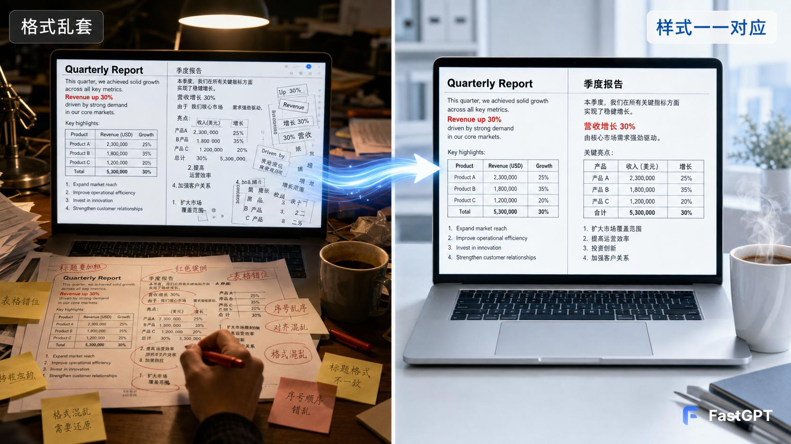
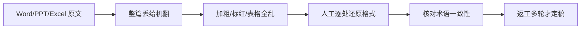
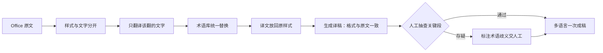

# AI 翻译

> 一份 Word 文档翻译完，内容翻对了、格式却全乱套——加粗的字不粗了、标红的字变黑了、表格错位、编号乱序。为什么？因为 Office 文档里的「加粗、标红、字体、表格」这些样式，是和文字紧紧绑在一起的；机翻把文字一换，样式就跟着散架，翻译再对也白搭。
> FastGPT 的思路反着来：**把「样式」和「文字」分开处理——样式原样保留，只翻译该翻的文字，翻译完再让译文回到原来的样式里**。加粗还是加粗、标红还是标红、表格还是表格。
> 某软件团队翻译技术文档后，译后人工从「逐处还原格式」变成「抽查关键段」，格式还原时间从每篇数小时降到接近零，术语与型号编号原样保留、前后一致。



> 【插图占位：格式保持翻译对照】
> 图片类型：对照截图
> 图片内容：左侧原文 Word（含加粗/标红/表格/编号），右侧译稿——同样的加粗、同样的标红、表格对齐、编号有序，样式逐项对应
> 获取方式：截图——FastGPT 应用 → 调试预览，输入一段含加粗/标红/表格的 Word 文档触发翻译，截「原文 + 译稿」左右对照画面

---

## 一、场景洞察与痛点

### 1.1 为什么文档翻译值得做 AI

把一段英文翻成中文，机器十年前就能做。企业文档翻译的真正卡点，几乎从来不在「翻」这一步，而在翻译之后被严重低估的一件脏活：**还原格式**。多数企业早就用上了机翻或翻译 SaaS，但这些工具**只解决了「文字从一种语言变成另一种语言」，没解决「样式怎么跟着文字一起无损过去」**。

要理解这件事为什么难，得先明白 Office 文档里的样式到底有多「粘」：加粗、标红、字体、表格、编号，这些样式不是浮在文字外层的装饰，而是和每一个字、每一段话紧紧绑在一起的。于是翻译时立刻撞上两难：**图省事整体机翻**——翻完只拿到一段没有样式的译文，加粗在哪、标红在哪全丢了，只能人工逐处还回去；**想精细又太琐碎**——一个字一个字对齐样式，工作量比手翻还大。这正是 AI 能补上的空位：**把「样式」和「文字」分开对待——样式原样保留、只翻译该翻的文字、再让译文回到原来的样式位置**。

### 1.2 共性痛点因链

| 现象 | 影响谁 | 根因 |
|------|--------|------|
| 加粗/标红/字体/颜色丢失 | 编辑返工、出品不专业 | 文字被整体机翻，样式与文字混在一起 |
| 表格错位、编号/单元格乱序 | 核对耗时、易漏 | 表格结构没被单独识别与保护 |
| 型号/编号/变量/专有名词被「顺手翻译」 | 技术文档直接出错 | 该保持原样的内容没有被保护 |
| 术语前后不一致 | 全文不统一、专业度打折 | 术语靠人记、没有术语库 |

四大根因不是孤立的，而是层层递进的同一条链：**格式混翻 → 结构错位 → 专名误译 → 术语漂移**。前面一环没拆开，后面一环只会更乱。下面第二章的每个模块，都从「把样式和文字分开」这一个动作出发，把「该保的」和「该译的」彻底分开。

### 1.3 适用条件

本方案适合具备以下条件的组织，条件越充分、收益越显著：

- 有大量 Word / PPT / Excel / PDF 等 Office 文档需要多语言，且格式与术语一致性要求高；
- 文档含加粗、标红、表格、编号、代码等样式，格式还原是真实痛点；
- 内容已经沉淀在文档库 / 知识库 / 共享盘 / Git 仓库中，而非散落在手工文档里；
- 有明确的术语责任方（AI 不替专业术语拍板，必须有人对术语库负责）。

> 若文档是扫描件图片，先做 OCR 再进入翻译；若术语尚未梳理，建议先建术语库再启动——这也是对客户负责的做法。

---

## 二、解决方案设计

### 2.1 总体蓝图

先看现状——翻译被「整体丢给机翻、再人工还原」，断点全卡在「把样式和文字混在一起」：



接入 FastGPT 后，流程变成「样式与文字分开 → 只译该译的 → 术语库统一 → 译文放回原样式」，断点逐个接上：



> 【插图占位：翻译业务架构图】
> 图片类型：架构图
> 图片内容：数据源（Office 文档/术语库/i18n 资源）→ 能力层（样式与文字分离/翻译/术语库/格式还原）→ 渠道层（文档库/Web/API）四层纵向
> 获取方式：制图——Mermaid 画四层纵向分层图，每层标注职责

### 2.2 怎么做到格式不乱

方案要讲的其实是同一句话的三个动作：**样式和文字分开**、**只译该译的**、**译完放回去**。落在具体能力上，是三件事：

1. **格式保持**：加粗、标红、字体、表格、编号这些样式，翻译前后原样不动，只替换文字本身，出来的译稿和原文格式一一对应。
2. **内容保护**：型号、编号、变量、品牌名这类「不能翻」的内容自动识别并原样保留，技术文档不会因为翻译而出错。
3. **术语统一**：术语由术语库统一管理、统一替换，全文前后一致，不再靠人记。

这三件事合起来，客户拿到的不只是一份「翻对的稿」，而是一份「翻对又排对、能直接发布」的稿。至于底层怎么把样式和文字拆开、怎么让译文回到原位——那是工程细节，客户不需要关心，也看不见；客户看得见的是：**加粗的字还加粗，标红的字还标红，表格还对齐，编号还顺。**

### 2.3 四类文档，一套方案

同一套「保持格式」的能力，落在不同的 Office 文档上都能用：

| 文档类型 | 覆盖内容 |
|------|------|
| Word（DOCX） | 正文、标题、表格里的段落，加粗/标红/字体原样保持 |
| PowerPoint（PPTX） | 每页文本框里的段落，排版与样式不变 |
| Excel（XLSX） | 单元格里的文本，表格结构不乱 |
| PDF | 先转换为可编辑文档，再走同一流程 |

### 2.4 多渠道 × 多系统覆盖

同一套结构解析与术语库在背后复用，人从哪个入口进来都能译：

| 入口/系统 | 接入方式 | 场景 |
|------|------|------|
| 文档库 / 知识库 | OpenAPI / 插件接入 | 在文档库内直接翻译一篇、批量翻译目录 |
| 邮件 / Web 免登录窗口 / 门户 | 分享链接 / iframe | 提交待译文档、团队统一翻译入口 |
| 小程序 / APP / 自研系统 | API 接入 | 产品内多语言资源同步、后端批量翻译 |
| 术语库 / i18n 资源 / TMS 记忆库 | API / 插件对接 | 源文档与术语的来源，翻译的数据底座 |

> 两个维度分开看，缺一不可：**渠道**是「人从哪进来翻译」（文档库、邮件、Web、API），解决翻译的出口；**系统**是「AI 接谁的源文档与术语」（文档库、术语库、i18n 资源、TMS），解决翻译的原料与一致性。只有渠道没有系统，方案就成了「只有前台没有后台」的翻译框；只有系统没有渠道，人又不知道从哪发起。

### 2.5 痛点一一对应解决（因果闭环）

四个模块不是功能堆叠，而是一条链：**格式保持 → 内容保护 → 术语库 → 译后抽查式审校**。每个模块都在消灭一个具体痛点，落地后变成一个可观察的结果：

| 客户痛点（脱敏） | 方案模块 | 落地后的结果 |
|------|---------|------------|
| 加粗/标红/字体/表格/编号丢失 | ① 格式保持 | 只译文字、样式原样保留，加粗还是加粗、标红还是标红 |
| 型号/编号/专名被翻 | ② 内容保护 | 型号编号、品牌名、技术术语原样保留 |
| 术语前后不一致 | ③ 术语库 | 术语统一替换、全文一致 |
| 译后逐处还原格式 | ④ 译后抽查式审校 | 格式还原时间从数小时降到接近零 |

**设计原则：AI 不越权**——翻译只替换文字、不擅改样式；术语冲突时标出歧义交人工定夺、不擅自替换；型号编号默认原样保护、不臆断；审校权与发布权始终在人。

### 2.6 长尾与边界场景（枚举四问）

主流程之外，主动把复杂场景点出来，证明方案经得起生产追问：

1. **结构/格式异常**：多语言批量、含截图文字、长文档分段——AI 按段落对齐，缺图注或对齐存疑时标黄交人工。
2. **术语/语义异常**：术语一词多义、缩写、品牌名、专有名词——术语库按场景配条目，歧义标黄交人工定夺。
3. **权限/合规异常**：敏感文档、保密协议、越权访问——文档留内网，按角色控可见，关键操作全程留痕可追溯。
4. **流程/系统异常**：译文截断、编码错乱、接口超时、并发峰值——分段校验长度、失败自动重试，异常可重试并留痕。

**能主动写出「哪些内容仍需人工审」，是这套方案成熟度的标志。**

### 2.7 人机分工总表

| 环节 | AI 全自动 | AI 生成 + 人工确认 | 人工主导 |
|------|:---:|:---:|:---:|
| 文档解析、翻译、格式还原 | ● | | |
| 重新打包、多语言成稿 | ● | | |
| 术语歧义、存疑段标注 | | ● | |
| 关键段审校 | | ● | |
| 最终发布与定稿 | | | ● |

这张表是整个方案的地基：**AI 负责「能自动执行的样式与文字处理」，人负责「需要判断力的术语与审校」**。客户对 AI 的信任，来自它知道自己不擅改样式、不替人定术语。

> 【插图占位：人机分工泳道图】
> 图片类型：人机分工图
> 图片内容：AI 全自动 / AI 生成+人工确认 / 人工主导 三列泳道，标出翻译流程各环节落在哪一列
> 获取方式：制图——Mermaid 画三列泳道图，把上表各环节落到对应泳道

---

## 三、落地价值与收益

### 3.1 价值维度

| 维度 | 面向对象 | 价值主张 |
|------|---------|---------|
| 格式一致 | 编辑、工程师 | 加粗/标红/字体与原文一一对应，不再逐处还原文案 |
| 术语规范 | 全公司 | 术语库统一，型号编号原样保留、全文前后一致 |
| 出品效率 | 内容团队 | 多语言一次成稿，翻译吞吐显著提升 |
| 保密合规 | 法务、管理层 | 待译文档与术语不出网，满足保密要求 |

### 3.2 量化框架（指标三件套）

每个数字都按「落地前 → 落地后 → 为什么变」交代因果，而非甩一个百分比：

| 价值维度 | 衡量口径 | 落地前 | 落地后 | 为什么变 |
|---------|---------|-------|-------|---------|
| 格式还原 | 译后格式还原时间 | 每篇数小时 | 接近零 | 样式保持替代逐处手工还原文案 |
| 样式保持 | 样式保持准确率 | 机翻后格式全乱 | 约 95% 以上 | 样式与文字分开、只译文字 |
| 术语一致 | 术语统一率 | 靠人记、前后不一 | 术语库统一替换 | 术语由术语库统一管理，不再靠人记 |
| 审校效率 | 译后审校方式 | 通读全文 | 抽查关键段 | 格式与术语已由规则保证，人只审存疑段 |

下面这张桑基图，把「一份文档怎么处理」画成一条流转路径——文字走翻译、样式走保持，最终在「合稿」重新汇合，一份内容无损：

```echarts
{
  "title": { "text": "一份 Office 文档的翻译流转", "subtext": "文字翻译、样式保持，两条流在合稿处汇合", "left": "center" },
  "tooltip": { "trigger": "item" },
  "series": [
    {
      "type": "sankey", "emphasis": { "focus": "adjacency" },
      "data": [
        { "name": "原文文档" },
        { "name": "文档解析" },
        { "name": "文字翻译" },
        { "name": "样式保持" },
        { "name": "术语库" },
        { "name": "合稿" },
        { "name": "译稿" }
      ],
      "links": [
        { "source": "原文文档", "target": "文档解析", "value": 100 },
        { "source": "文档解析", "target": "文字翻译", "value": 55 },
        { "source": "文档解析", "target": "样式保持", "value": 45 },
        { "source": "文字翻译", "target": "术语库", "value": 55 },
        { "source": "样式保持", "target": "合稿", "value": 45 },
        { "source": "术语库", "target": "合稿", "value": 55 },
        { "source": "合稿", "target": "译稿", "value": 100 }
      ]
    }
  ]
}
```

这张桑基图把「一份文档的内容」拆成两条流：约 55% 是文字，翻译后经术语库统一替换；约 45% 是样式（加粗、标红、字体），原样保持——两条流在「合稿」重新汇合，一份内容无损。它讲的是「样式和文字被正确分开对待」，而不是甩一个「翻译效率提升 90%」的空数字。

### 3.3 ROI 与回本周期

「值不值」要算得出来：**回本周期 = 一次性投入 ÷ 月净收益**，公开场景用区间与百分比表达，不写绝对金额：

| 类别 | 构成 |
|------|------|
| 一次性投入 | 软件授权 / License、服务器或云资源、实施与集成、术语库与格式规则冷启动、培训 |
| 持续性投入 | 模型调用 / API 费用、运维人力、术语库与格式规则更新 |
| 收益（钱） | 人力节省：译后格式还原从数小时降到接近零释放的编辑/工程师人力、审校从通读变抽查 |
| 收益（折算） | 翻译吞吐提升、多语言内容同步上线带来的市场价值 |

> 某软件团队脱敏参考：一次性投入主要为授权 + 实施 + 术语库冷启动，月净收益来自译后返工消失与翻译吞吐提升，**预计 4-7 个月回本**；未计入多语言上线的市场价值，属保守估算。回本周期用区间表达、不承诺具体数值；正式交付时以企业自身文档量与审校成本按月复测，用数据说话。

---

## 四、落地路径与运营

### 4.1 分阶段推进节奏

方案落地遵循「**先验证、再试点、后规模化**」，每阶段有明确动作和验收口径：

| 阶段 | 目标 | 典型动作 | 验收口径 |
|------|------|---------|---------|
| 验证 | 用真实样本证明核心链路可行 | 拿一类样式最复杂的文档（含加粗/标红/表格）测样式保持准确率与术语一致性 | 样式保持、术语一致达到约定口径 |
| 试点 | 在一个翻译量大的团队真跑 | 技术文档团队上线，收集使用反馈 | 格式还原时间、审校方式达到口径 |
| 规模化 | 全公司推广并覆盖全部文档类型与语种 | 对接文档库/术语库/i18n/TMS，全量上线 | 全量运行，术语维护闭环建立，运营机制运转 |

> 具体周期和阈值视组织规模、文档条件与配合度调整；我们不承诺「一次上线、永久可用」，而是交付可持续运营的机制。

### 4.2 数据与规则冷启动

- 优先梳理**术语库、格式规则、不可译内容清单**，这是样式保持与术语一致的地基；
- 先用小批量真实文档样本验证样式保持准确率，再增量补充历史文档与译稿；
- 每批导入后人工抽检、纠错回流，避免「错的术语越滚越大」。

### 4.3 持续运营闭环

- **术语纠错回流**：术语歧义被人工定夺后，回流优化术语库；
- **格式规则迭代**：业务方补充新文档类型、修订旧格式规则，同步到解析与格式还原；
- **效果复测**：按月复测格式还原时间、术语一致性，找出下滑原因；
- **规则更新**：术语与格式规范修订后同步更新，杜绝「旧术语误导新译稿」。

> 【插图占位：运营仪表板截图】
> 图片类型：界面截图
> 图片内容：翻译量、样式保持准确率、格式还原时间的运营曲线
> 获取方式：截图——FastGPT 应用 → 数据统计，截运营仪表板，展示「越用越准」的复测闭环

---

## 五、选型价值与下一步

### 5.1 FastGPT 企业级价值（能力 → 证据 → 收益）

我们交付的不是一个工具，而是一套跑得通、控得住、越用越准的 Office 文档翻译体系。它建立在这些企业级能力之上：

| 能力 | 证据 | 对翻译场景的收益 |
|------|------|----------------|
| 私有化部署，数据自控 | 系统部署在企业内网 | 待译文档与术语库不出网，满足保密与合规要求 |
| OpenAPI 完整开放 | 兼容 OpenAI 接口格式 | 对接文档库/知识库/TMS，AI 嵌入现有工作入口 |
| 模型无关 | 可切换 DeepSeek/通义千问/GLM 等 | 多语种选性价比最优，不被单一模型供应商绑定 |
| 零代码可视化编排 | 现有 IT 团队拖拽搭建 | 从零到上线约 4-6 周，无需招聘 AI 工程师 |
| 免费 POC 概念验证 | 针对真实场景搭建验证 | 用企业真实文档实测样式保持与术语一致，零风险试用 |

### 5.2 选型顾虑回应

- **对比翻译 SaaS / TMS**：SaaS 多为按字数收费、数据在第三方、格式规则难深度定制；本方案私有化部署、格式规则与术语库可按企业持续迭代，更适合对格式一致与保密要求高的组织。
- **对比自研方案**：自研需要 AI 工程师与数月研发周期；本方案基于成熟底座与可视化编排，由现有 IT 团队在数周内落地。
- **对比通用 AI 翻译**：通用翻译缺样式保持与术语库，加粗/标红会被误译、格式会乱；本方案内置格式保持、内容保护与术语库，并与文档系统打通。

### 5.3 预约免费 POC

> 如需进一步验证，点击页面右侧「预约免费 POC」，用企业自身的文档、术语库与格式规则，实测样式保持准确率与译后审校时间，用数据验证前文落地效果。
