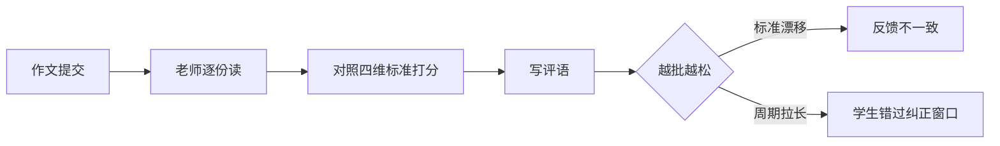
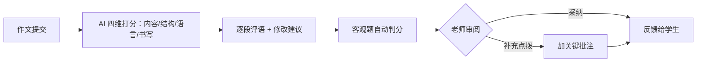

# AI 作业批改

> 一份作文 5-8 分钟，一个班 50 份，就是整个周末——这是语文老师再熟悉不过的账。更难的还不是时间，是每份都要从「内容、结构、语言、书写」四个维度给出具体、不重样的评语，批到第 40 份，耐心和标准都在下滑。
> FastGPT 把批改拆成「四维打分 + 逐段评语」：作文进来，AI 从内容、结构、语言、书写四个维度分别评判、给出针对性评语与修改建议，客观题自动判、主观题给多维反馈。老师从「逐份批改」变成「审阅 AI 反馈 + 补充关键点拨」。
> 某中学语文组接入后，单份作文批改从 5-8 分钟降到约 1 分钟，评语维度一致、不再越批越松，学生拿到反馈更快。

> 【插图占位：作文四维批改】
> 图片类型：界面截图
> 图片内容：一篇作文原文，右侧面板显示「内容/结构/语言/书写」四维打分与逐段评语、修改建议
> 获取方式：截图——FastGPT 应用 → 调试预览，上传/粘贴一篇作文触发批改，截「原文 + 四维反馈」同屏画面，学生姓名与班级打码

---

## 一、场景洞察与痛点

### 1.1 为什么作业批改值得做 AI

把「批作文」拆开看，会发现老师其实在同时做两件性质完全不同的事：**一件是机械的、可重复的——判对错、数病句、按四维标准打分；一件是判断的、只能由人做的——判断这个学生的问题在哪、该给什么点拨**。多数学校不是没有批改工具——客观题早就有了阅卷机——而是**这些工具只解决了「标准答案的判分」，没解决「主观题的多维反馈」**：作文这样的主观题，四维标准靠人脑记、逐段评语靠人手写，批到第 40 份，标准开始漂移、评语开始雷同。于是批改的价值链条断裂在「主观题」这一环：机械判分能自动化，深度反馈却全压在老师身上，而这两件事混在一起，让老师既累又难保证一致性。这正是 AI 能补上的空位——**把「机械的可自动化」交给 AI，把「判断的必须留人」留给老师**。

### 1.2 共性痛点因链

| 现象 | 影响谁 | 根因 |
|------|--------|------|
| 每份 5-8 分钟、整班就是周末 | 老师耗时 | 逐字逐句靠人读 |
| 评语越批越松、标准漂移 | 学生反馈不一致 | 四维标准靠人脑记 |
| 客观题 + 主观题混着批 | 老师负担重 | 机械批改与深度反馈不分 |
| 反馈慢、学生错过纠正窗口 | 学习效果打折 | 批改周期长 |

四大根因不是孤立的，而是层层递进的同一条链：**逐字靠人读 → 标准靠人记 → 机械与判断不分 → 反馈周期拉长**。前面一环没拆开，后面一环只会更拖。下面第二章的每个模块，就是把这「机械的可自动化」和「判断的必须留人」两类活彻底分开。

### 1.3 适用条件

本方案适合具备以下条件的组织，条件越充分、收益越显著：

- 有作文 / 主观题批改需求，希望反馈更及时、更一致，又不想让老师被机械批改淹没；
- 有相对明确的评分标准（四维指标、文体/学段规则），这是 AI 打分的原料；
- 有明确的评分责任方（AI 给反馈，最终判定与点拨权在老师）；
- 已使用学生端 / 教师端 / 企微 / 钉钉 / 飞书等入口（降低采用门槛）；
- 批改量达到一定规模，AI 的批改能力才有规模收益。

> 若涉及高利害考试阅卷或升学评分，AI 反馈仅供教师参考、不作最终判定；若评分标准尚未梳理，建议先定标准再启动——这也是对教育负责的做法。

---

## 二、解决方案设计

### 2.1 总体蓝图

先看现状——批改把「机械判分」和「深度反馈」混在一起，断点全卡在「靠人」：



接入 FastGPT 后，批改变成「四维打分 → 逐段评语 → 老师审阅点拨」，断点逐个接上：



> 【插图占位：作业批改业务架构图】
> 图片类型：架构图
> 图片内容：数据源（评分标准/文体规则/学段规则/题库）→ 能力层（四维打分/逐段评语/客观判分）→ 渠道层（学生端/教师端/家长端/企微/钉钉/飞书/API）四层纵向
> 获取方式：制图——Mermaid 画四层纵向分层图，每层标注职责

### 2.2 多渠道 × 多系统覆盖

同一套四维批改标准在背后复用，学生提交、老师审阅、家长查看从哪个入口进来都能用：

| 入口/系统 | 接入方式 | 场景 |
|------|------|------|
| 学生端 / 教师端 / 家长端 Web | 登录门户 / iframe | 学生提交作文、老师批量审阅、家长收反馈 |
| 企微 / 钉钉 / 飞书机器人 | OpenAPI 接入 | 班级群里布置作业、推送批改反馈 |
| 小程序 / APP / 自研系统 | API 接入 | 拍照上传、练习端即时批改 |
| LMS / 教务 / 成绩 / 题库系统 | API / 插件对接 | 名单、作业、成绩流转与留痕 |

> 两个维度分开看，缺一不可：**渠道**是「人从哪进来提交/批改」（学生端、教师端、家长端、IM、API），解决批改的出口；**系统**是「AI 接谁的名单与成绩」（LMS、教务、成绩、题库），解决批改的业务打通。只有渠道没有系统，方案就成了「只有前台没有后台」的批改框；只有系统没有渠道，师生又不知道从哪进。

落到一个具体画面：学生拍照上传作文、老师在教师端批量审阅 AI 反馈、家长在企微群里收到批改结果——三个角色、两个入口、多套后端，背后是同一套四维批改标准。

### 2.3 痛点一一对应解决（因果闭环）

四个模块不是功能堆叠，而是一条链：**四维自动批改 → 标准统一 → 客观题自动判分 → 即时反馈**。每个模块都在消灭一个具体痛点，落地后变成一个可观察的结果：

| 客户痛点（脱敏） | 方案模块 | 落地后的结果 |
|------|---------|------------|
| 每份 5-8 分钟 | ① 四维自动批改 | 单份约 1 分钟，老师只审阅点拨 |
| 评语越批越松 | ② 标准统一 | 四维标准固化，评语维度一致 |
| 客观题主观题混着批 | ③ 客观题自动判分 | 机械判分自动化，主观题给多维反馈 |
| 反馈慢 | ④ 即时反馈 | 提交即出反馈，纠正窗口拉长 |

**设计原则：AI 不越权**——批改只给反馈与建议、不打最终分（高利害场景）；四维评分供参考、老师可改；评语只作教学辅助、不替老师下结论；学生隐私数据留内网。

### 2.4 长尾与边界场景（枚举四问）

主流程之外，主动把复杂场景点出来，证明方案经得起生产追问：

1. **文体/学段异常**：多文体、多学段、语言能力差异——评分标准按文体/学段配置，边界题标黄提示。
2. **识别/输入异常**：字迹潦草、拍照不清——先 OCR，识别不清标黄转人工。
3. **评语/标准异常**：评语雷同、模板化、标准漂移——按四维差异生成，老师可加批注纠偏。
4. **权限/合规异常**：成绩隐私、越权访问、阅卷保密——数据留内网，按角色控可见，关键操作全程留痕。

**能主动写出「哪些环节仍需教师亲手批」，是这套方案成熟度的标志。**

### 2.5 人机分工总表

| 环节 | AI 全自动 | AI 生成 + 人工确认 | 人工主导 |
|------|:---:|:---:|:---:|
| 四维打分、逐段评语、客观题判分 | ● | | |
| 即时反馈生成 | ● | | |
| 审阅、补充点拨、改分 | | ● | |
| 高利害考试评分 | | | ● |

这张表是整个方案的地基：**AI 负责「能自动判定的打分」，人负责「需要判断力的点拨」**。客户对 AI 的信任，来自它知道自己只给反馈、不替老师下结论。

> 【插图占位：人机分工泳道图】
> 图片类型：人机分工图
> 图片内容：AI 全自动 / AI 生成+人工确认 / 人工主导 三列泳道，标出批改各环节落在哪一列
> 获取方式：制图——Mermaid 画三列泳道图，把上表各环节落到对应泳道

---

## 三、落地价值与收益

### 3.1 价值维度

| 维度 | 面向对象 | 价值主张 |
|------|---------|---------|
| 老师减负 | 教师 | 从「逐份批改」变为「审阅反馈 + 补充点拨」 |
| 反馈一致 | 学生 | 四维标准固化，评语不再越批越松 |
| 及时反馈 | 学生、家长 | 提交即出反馈，纠正窗口拉长 |
| 教学洞察 | 教师、管理层 | 四维表现可统计，班级共性问题一目了然 |

### 3.2 量化框架（指标三件套）

每个数字都按「落地前 → 落地后 → 为什么变」交代因果，而非甩一个百分比：

| 价值维度 | 衡量口径 | 落地前 | 落地后 | 为什么变 |
|---------|---------|-------|-------|---------|
| 批改效率 | 单份作文批改耗时 | 约 5-8 分钟 | 约 1 分钟 | 四维打分 + 逐段评语自动化，老师只审阅点拨 |
| 反馈一致 | 评语标准一致率 | 越批越松 | 四维标准固化 | 评分标准统一配置，不再靠人脑记 |
| 反馈及时 | 反馈交付周期 | 数天（整班批完） | 提交即出 | 即时批改替代批改周期 |
| 覆盖范围 | 客观题自动判分率 | 手工/阅卷机 | 全量自动 | 客观题自动判分，主观题给多维反馈 |

下面这张雷达图，把「一份作文在四个维度上的表现」画成一个多边形——这就是学生一眼能看懂自己强弱的方式：

```echarts
{
  "title": { "text": "一份作文的四维表现", "subtext": "四维越均衡、面积越大越好", "left": "center" },
  "tooltip": {},
  "legend": { "bottom": 0 },
  "radar": {
    "indicator": [
      { "name": "内容", "max": 100 },
      { "name": "结构", "max": 100 },
      { "name": "语言", "max": 100 },
      { "name": "书写", "max": 100 }
    ]
  },
  "series": [
    {
      "type": "radar",
      "data": [
        { "value": [82, 70, 78, 55], "name": "本份作文", "areaStyle": { "opacity": 0.15 }, "itemStyle": { "color": "primary" } },
        { "value": [70, 68, 70, 70], "name": "班级均值", "itemStyle": { "color": "neutral" } }
      ]
    }
  ]
}
```

这张雷达图把「一份作文的强弱」画成一个多边形：本份作文内容 82、语言 78 都不错，但书写只有 55、明显拖后腿，一眼就能看出「该补哪块」。它把四维批改的「多维反馈」落到实处——不是甩一个「总分 85」的空数字，而是画出四个维度各自的强弱与和班级均值的差距，让学生知道下一步练什么。

### 3.3 ROI 与回本周期

「值不值」要算得出来：**回本周期 = 一次性投入 ÷ 月净收益**，公开场景用区间与百分比表达，不写绝对金额：

| 类别 | 构成 |
|------|------|
| 一次性投入 | 软件授权 / License、服务器或云资源、实施与集成、评分标准与文体规则冷启动、培训 |
| 持续性投入 | 模型调用 / API 费用、运维人力、评分标准与文体规则更新 |
| 收益（钱） | 人力节省：批改从 5-8 分钟降到约 1 分钟释放的教师人力 |
| 收益（折算） | 反馈及时带来的教学效果提升、评语一致带来的学生体验改善 |

> 某中学语文组脱敏参考：一次性投入主要为授权 + 实施 + 评分标准冷启动，月净收益来自批改时间释放，**预计 5-8 个月回本**；未计入教学效果的长期价值，属保守估算。回本周期用区间表达、不承诺具体数值；正式交付时以学校自身批改量与教师成本按月复测，用数据说话。

---

## 四、落地路径与运营

### 4.1 分阶段推进节奏

方案落地遵循「**先验证、再试点、后规模化**」，每阶段有明确动作和验收口径：

| 阶段 | 目标 | 典型动作 | 验收口径 |
|------|------|---------|---------|
| 验证 | 用真实样本证明核心链路可行 | 拿一种文体（如记叙文/作文）测四维评分与评语质量 | 评分一致性、评语质量达到约定口径 |
| 试点 | 在一个年级真跑 | 某年级上线，收集师生反馈 | 批改时间、反馈满意度达到口径 |
| 规模化 | 全机构推广并覆盖多文体多学段 | 对接 LMS/教务/成绩/题库，全量上线 | 全量运行，标准维护闭环建立，运营机制运转 |

> 具体周期和阈值视机构规模、教学条件与配合度调整；我们不承诺「一次上线、永久可用」，而是交付可持续运营的机制。

### 4.2 数据与规则冷启动

- 优先梳理**评分标准、四维指标、文体/学段规则**，这是四维打分的地基；
- 先用小批量作文样本验证评分一致性与评语质量，再增量补充历史批改样例；
- 每批导入后人工抽检、纠错回流，避免「偏的标准越滚越大」。

### 4.3 持续运营闭环

- **评分纠错回流**：评分与评语被老师改分后，回流优化评分标准；
- **文体规则迭代**：业务方补充新文体、修订旧规则，同步到四维打分；
- **效果复测**：按月复测批改时间、反馈满意度，找出下滑原因；
- **标准更新**：评分规范修订后同步更新，杜绝「旧标准批新文」。

> 【插图占位：运营仪表板截图】
> 图片类型：界面截图
> 图片内容：批改量、评分一致率、反馈满意度的运营曲线
> 获取方式：截图——FastGPT 应用 → 数据统计，截运营仪表板，展示「越用越准」的复测闭环

---

## 五、选型价值与下一步

### 5.1 FastGPT 企业级价值（能力 → 证据 → 收益）

我们交付的不是一个工具，而是一套跑得通、控得住、越用越准的作业批改体系。它建立在这些企业级能力之上：

| 能力 | 证据 | 对批改场景的收益 |
|------|------|----------------|
| 私有化部署，数据自控 | 系统部署在机构内网 | 学生作文与成绩不出网，满足隐私要求 |
| OpenAPI 完整开放 | 兼容 OpenAI 接口格式 | 对接 LMS/教务/成绩/题库，AI 嵌入现有流程 |
| 模型无关 | 可切换 DeepSeek/通义千问/GLM 等 | 多文体选性价比最优，不被单一模型供应商绑定 |
| 零代码可视化编排 | 现有 IT 团队拖拽搭建 | 从零到上线约 4-6 周，无需招聘 AI 工程师 |
| 免费 POC 概念验证 | 针对真实场景搭建验证 | 用真实作文实测四维评分与评语质量，零风险试用 |

### 5.2 选型顾虑回应

- **对比批改 SaaS**：SaaS 多为按账号收费、数据在第三方、标准难深度定制；本方案私有化部署、评分标准可按机构持续迭代，更适合对反馈一致与数据隐私要求高的机构。
- **对比自研方案**：自研需要 AI 工程师与数月研发周期；本方案基于成熟底座与可视化编排，由现有 IT 团队在数周内落地。
- **对比通用 AI 助手**：通用助手缺评分标准与系统对接，评语易雷同；本方案内置四维打分与客观判分，并与成绩系统打通。

### 5.3 预约免费 POC

> 如需进一步验证，点击页面右侧「预约免费 POC」，用机构自身的评分标准与文体规则，实测四维评分准确率与批改时间，用数据验证前文落地效果。
