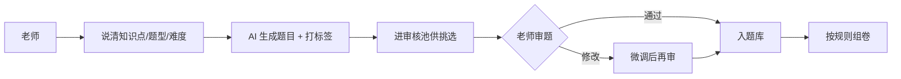

# AI 出题组卷

> 周三晚上 11 点，数学老师还在办公室出下个月的月考卷——不是想加班，是一份卷子要从头搭：挑知识点、凑题型、控制难度、再一道一道验算，少说三四个小时。
> FastGPT 把「从知识点到一道能用的题」变成一条流水线：说清要哪个知识点、什么题型、多难，AI 生成题目并打上知识点与难度标签，进审核池供老师挑，再按规则组卷。老师从「从头出题」变成「选题 + 把关」。
> 某培训机构接入后，一套单元卷的初稿时间从 3-4 小时降到约 10-15 分钟，题目带知识点与难度标签、可追溯，题库随使用越攒越厚。

> 【插图占位：出题与组卷界面】
> 图片类型：界面截图
> 图片内容：左侧输入「八年级 一次函数 中等难度 选择题 5 道」，右侧生成带知识点/难度标签的题目列表与一键组卷按钮
> 获取方式：截图——FastGPT 应用 → 调试预览，输入一条出题指令触发生成，截「指令 + 题目列表」同屏画面

---

## 一、场景洞察与痛点

### 1.1 为什么出题组卷值得做 AI

出题的人都知道，难的从来不是「想一道题」，而是把这道题**变成一道能用的题**。多数学校与机构不是没有题库——各种题库平台、组卷系统也用了不少——而是**这些工具只承载了「题目存哪里」，没解决「题目怎么从知识点的想法变成一道打上标签、验过答案、能反复复用的题」**：挑知识点靠人脑从头搭、凑题型控难度靠经验、验算答案一道一道来、组卷难度忽高忽低。于是出题的价值链条断裂在「从想法到入库」这一段：老师想省的不是「想题」的脑力，而是「造题」的体力，但把想法变成可用题目这件事，全压在老师一个人身上。这正是 AI 能补上的空位——**把「从知识点到题目初稿」交给规则，把「判断这道题好不好、适不适合我的学生」留给老师**。

### 1.2 共性痛点因链

| 现象 | 影响谁 | 根因 |
|------|--------|------|
| 挑知识点、凑题型、控难度 | 老师耗时、难平衡 | 出题靠人脑从头搭 |
| 题目没标签、难复用 | 下次出卷还得重来 | 题目散落、无结构化标签 |
| 验算答案、避免出错 | 出错影响公信 | 题目答案靠人一道一道核 |
| 组卷拼凑、难度忽高忽低 | 卷子质量不稳 | 组卷规则靠人经验 |

四大根因不是孤立的，而是层层递进的同一条链：**出题靠人搭 → 标签靠人贴 → 答案靠人验 → 组卷靠人凑**。前面一环没标准化，后面一环只会更慢。下面第二章的每个模块，就是这条「知识点 → 题目 → 审核 → 入库」流水线上的一环，把「靠人」换成「靠规则」。

### 1.3 适用条件

本方案适合具备以下条件的组织，条件越充分、收益越显著：

- 有出卷 / 作业 / 题库需求，教学围绕知识点展开，且有相对固定的题型与难度规范；
- 有明确的命题责任方（AI 出初稿，最终定稿权必须留在教师手里）；
- 出卷频次与题量达到一定规模，AI 的生成与组卷能力才有规模收益；
- 已使用教师端 / 教务端 / 企微 / 钉钉 / 飞书等入口（降低采用门槛）；
- 希望题库可持续积累、可追溯复用，而非一次性出题。

> 若题目涉及原创竞赛题或高利害考试，AI 出初稿后仍需教师严格审校；若知识点体系尚未梳理，建议先建标签体系再启动——这也是对教育负责的做法。

---

## 二、解决方案设计

### 2.1 总体蓝图

先看现状——出题是一张白纸从零开始，断点全卡在「靠人」：


接入 FastGPT 后，出题变成「生成 → 审核 → 入库 → 组卷」，断点逐个接上：



> 【插图占位：出题组卷业务架构图】
> 图片类型：架构图
> 图片内容：数据源（题库/教务/教材/知识点体系）→ 能力层（智能出题/标签化/组卷规则）→ 渠道层（教师端/教务端/企微/钉钉/飞书/API）四层纵向
> 获取方式：制图——Mermaid 画四层纵向分层图，每层标注职责

### 2.2 多渠道 × 多系统覆盖

同一套题库与标签体系在背后复用，老师从哪个入口进来都能出题：

| 入口/系统 | 接入方式 | 场景 |
|------|------|------|
| 教师端 / 教务端 Web | 登录门户 / iframe | 出正式卷、组卷、题库管理 |
| 企微 / 钉钉 / 飞书机器人 | OpenAPI 接入 | 群聊里出一套随堂小测 |
| 小程序 / APP / 自研系统 | API 接入 | 教学后端、学生练习端 |
| 题库 / 教务 / 组卷 / LMS 系统 | API / 插件对接 | 题目的存取与复用、成绩流转 |

> 两个维度分开看，缺一不可：**渠道**是「人从哪进来出题」（教师端、教务端、IM、API），解决出题的出口；**系统**是「AI 接谁的题库与教材」（题库、教务、组卷、LMS），解决题目的原料与复用。只有渠道没有系统，方案就成了「只有前台没有后台」的出题框；只有系统没有渠道，老师又不知道从哪进。

落到一个具体画面：老师在企微群里 @机器人 出一套随堂小测、教务在 Web 端出一份期末卷、题目生成后进题库供下次复用——两个入口、两套后端，背后是同一套题库与标签体系。

### 2.3 痛点一一对应解决（因果闭环）

四个模块不是功能堆叠，而是一条链：**智能出题 → 标签化入库 → 答案与解析生成 → 规则组卷**。每个模块都在消灭一个具体痛点，落地后变成一个可观察的结果：

| 客户痛点（脱敏） | 方案模块 | 落地后的结果 |
|------|---------|------------|
| 挑知识点/凑题型/控难度 | ① 智能出题 | 一句话生成带标签的题目初稿 |
| 题目没标签难复用 | ② 标签化入库 | 知识点/题型/难度标签齐全，可追溯可复用 |
| 验算答案怕出错 | ③ 答案与解析生成 | 附答案与解析，老师审校而非从头算 |
| 组卷拼凑难度不稳 | ④ 规则组卷 | 按题型/难度/分值规则自动组卷 |

**设计原则：AI 不越权**——出题只出初稿、附标签与解析，入库权在老师；难度与知识点标签供参考、可改；高利害考试的题由老师最终把关；AI 不替代教学判断。

### 2.4 长尾与边界场景（枚举四问）

主流程之外，主动把复杂场景点出来，证明方案经得起生产追问：

1. **知识点/学科异常**：知识点冷门、多学科交叉、年级差异——标签体系按学段学科配置，冷门题标黄提示。
2. **题目/答案异常**：题目雷同、超纲、难度不符、答案错误——查重、按大纲校验，异常标黄回退重生成。
3. **质量/权威异常**：解析缺失、争议题、高利害考试题——老师审校兜底，高利害题由教师严格把关。
4. **权限/合规异常**：题库泄露、越权访问、命题保密——题库留内网，按角色控可见，关键操作全程留痕。

**能主动写出「哪些题仍需教师严格审」，是这套方案成熟度的标志。**

### 2.5 人机分工总表

| 环节 | AI 全自动 | AI 生成 + 人工确认 | 人工主导 |
|------|:---:|:---:|:---:|
| 生成题目、打标签、附解析 | ● | | |
| 规则组卷 | ● | | |
| 审题、修改、入库 | | ● | |
| 难度与知识点把关 | | ● | |
| 高利害考试最终定稿 | | | ● |

这张表是整个方案的地基：**AI 负责「能自动生成的初稿」，人负责「需要判断力的审题」**。客户对 AI 的信任，来自它知道自己只出初稿、不替老师定稿。

> 【插图占位：人机分工泳道图】
> 图片类型：人机分工图
> 图片内容：AI 全自动 / AI 生成+人工确认 / 人工主导 三列泳道，标出出题组卷各环节落在哪一列
> 获取方式：制图——Mermaid 画三列泳道图，把上表各环节落到对应泳道

---

## 三、落地价值与收益

### 3.1 价值维度

| 维度 | 面向对象 | 价值主张 |
|------|---------|---------|
| 老师减负 | 教师 | 从「从头造题」变为「选题 + 把关」，时间还给教研 |
| 题库积累 | 学校、机构 | 题目带标签入库，越用越厚、可复用 |
| 卷面质量 | 学生、家长 | 难度分布可控、题型搭配合理、答案可追溯 |
| 命题合规 | 教务、管理层 | 命题过程留痕、标签可追溯、公信有据 |

### 3.2 量化框架（指标三件套）

每个数字都按「落地前 → 落地后 → 为什么变」交代因果，而非甩一个百分比：

| 价值维度 | 衡量口径 | 落地前 | 落地后 | 为什么变 |
|---------|---------|-------|-------|---------|
| 出卷效率 | 一套卷初稿时间 | 约 3-4 小时 | 约 10-15 分钟 | AI 生成 + 规则组卷替代手工从头搭 |
| 生成质量 | 题目生成可利用率 | 从零手工 | 约 60% 以上 | 生成后老师审校筛选，通过者入库复用 |
| 标签追溯 | 题目标签齐全率 | 手工散落 | 结构化标签齐全 | 知识点/题型/难度标签自动打、可追溯 |
| 复用积累 | 题库复用率 | 一次性出题 | 随使用递增 | 标签化入库让好题可被反复复用 |

下面这张漏斗图，把「从知识点到入库」每一层的留存画出来——这就是题库越用越厚的机制：

```echarts
{
  "title": { "text": "从知识点到入库的留存", "subtext": "每一层都有损耗，入库的是能复用的好题", "left": "center" },
  "tooltip": { "trigger": "item", "formatter": "{b}: {c}" },
  "series": [
    {
      "type": "funnel", "left": "10%", "width": "80%", "sort": "descending",
      "label": { "formatter": "{b}" },
      "data": [
        { "value": 100, "name": "知识点需求", "itemStyle": { "color": "primary" } },
        { "value": 88, "name": "AI 生成题目", "itemStyle": { "color": "cyan" } },
        { "value": 62, "name": "老师审核通过", "itemStyle": { "color": "violet" } },
        { "value": 55, "name": "入库复用", "itemStyle": { "color": "success" } }
      ]
    }
  ]
}
```

这张漏斗图把「题库越用越厚」这件事讲成一个可感的机制：100 份知识点需求，AI 生成 88 份题目初稿，老师审核后 62 份通过、最终 55 份入库复用。每一层都有真实损耗——这不是坏消息，恰恰是「人工把关」的可视化：不是甩一个「生成 100% 可用」的空数字，而是诚实画出「AI 生成 → 老师筛选 → 入库积累」的留存路径。

### 3.3 ROI 与回本周期

「值不值」要算得出来：**回本周期 = 一次性投入 ÷ 月净收益**，公开场景用区间与百分比表达，不写绝对金额：

| 类别 | 构成 |
|------|------|
| 一次性投入 | 软件授权 / License、服务器或云资源、实施与集成、标签体系与组卷规则冷启动、培训 |
| 持续性投入 | 模型调用 / API 费用、运维人力、标签体系与题库维护 |
| 收益（钱） | 人力节省：出卷从 3-4 小时降到 10-15 分钟释放的教师人力、题库复用减少的重复劳动 |
| 收益（折算） | 卷面质量提升带来的教学效果、题库长期复用的累积价值 |

> 某培训机构脱敏参考：一次性投入主要为授权 + 实施 + 标签体系冷启动，月净收益来自出卷时间释放与题库复用，**预计 5-8 个月回本**；未计入题库长期复用的累积价值，属保守估算。回本周期用区间表达、不承诺具体数值；正式交付时以机构自身出卷量与审校成本按月复测，用数据说话。

---

## 四、落地路径与运营

### 4.1 分阶段推进节奏

方案落地遵循「**先验证、再试点、后规模化**」，每阶段有明确动作和验收口径：

| 阶段 | 目标 | 典型动作 | 验收口径 |
|------|------|---------|---------|
| 验证 | 用真实样本证明核心链路可行 | 拿一个学科（如数学）测题目生成质量与标签准确率 | 题目可利用率、标签准确率达到约定口径 |
| 试点 | 在一个年级真跑 | 某年级上线，收集教师反馈 | 出卷时间、复用率达到口径 |
| 规模化 | 全机构推广并覆盖多学科多年级 | 对接题库/教务/LMS，全量上线 | 全量运行，题库积累闭环建立，运营机制运转 |

> 具体周期和阈值视机构规模、教学条件与配合度调整；我们不承诺「一次上线、永久可用」，而是交付可持续运营的机制。

### 4.2 数据与规则冷启动

- 优先梳理**知识点体系、题型/难度标签、组卷规则**，这是生成与组卷的地基；
- 先用小批量题目样本验证生成质量与标签准确率，再增量补充历史题目；
- 每批导入后人工抽检、纠错回流，避免「错题与错标签越滚越大」。

### 4.3 持续运营闭环

- **题目纠错回流**：答案错误被老师纠正后，回流优化生成与校验；
- **标签迭代**：业务方补充新学科、修订旧标签，同步到标签体系；
- **效果复测**：按月复测出卷时间、题目复用率，找出下滑原因；
- **规则更新**：命题规范修订后同步更新组卷规则，杜绝「旧规则组新卷」。

> 【插图占位：运营仪表板截图】
> 图片类型：界面截图
> 图片内容：出卷量、题目可利用率、题库复用率的运营曲线
> 获取方式：截图——FastGPT 应用 → 数据统计，截运营仪表板，展示「越用越厚」的复测闭环

---

## 五、选型价值与下一步

### 5.1 FastGPT 企业级价值（能力 → 证据 → 收益）

我们交付的不是一个工具，而是一套跑得通、控得住、越用越厚的出题组卷体系。它建立在这些企业级能力之上：

| 能力 | 证据 | 对出题场景的收益 |
|------|------|----------------|
| 私有化部署，数据自控 | 系统部署在机构内网 | 题库与命题数据不出网，满足保密要求 |
| OpenAPI 完整开放 | 兼容 OpenAI 接口格式 | 对接题库/教务/组卷/LMS，AI 嵌入现有流程 |
| 模型无关 | 可切换 DeepSeek/通义千问/GLM 等 | 多学科选性价比最优，不被单一模型供应商绑定 |
| 零代码可视化编排 | 现有 IT 团队拖拽搭建 | 从零到上线约 4-6 周，无需招聘 AI 工程师 |
| 免费 POC 概念验证 | 针对真实场景搭建验证 | 用真实题目实测生成质量与标签准确率，零风险试用 |

### 5.2 选型顾虑回应

- **对比题库 SaaS**：SaaS 多为按账号收费、数据在第三方、标签体系难深度定制；本方案私有化部署、标签与组卷规则可按机构持续迭代，更适合对题目质量与题库积累要求高的机构。
- **对比自研方案**：自研需要 AI 工程师与数月研发周期；本方案基于成熟底座与可视化编排，由现有 IT 团队在数周内落地。
- **对比通用 AI 助手**：通用助手缺题库对接与组卷规则，题目无标签难复用；本方案内置标签化入库与规则组卷，并与题库系统打通。

### 5.3 预约免费 POC

> 如需进一步验证，点击页面右侧「预约免费 POC」，用机构自身的知识点体系、题型与难度标签，实测生成质量与出卷时间，用数据验证前文落地效果。
