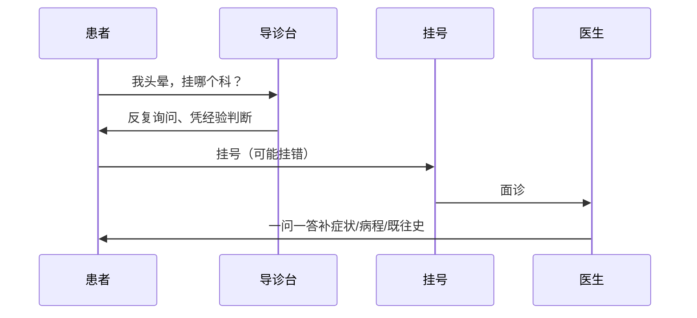
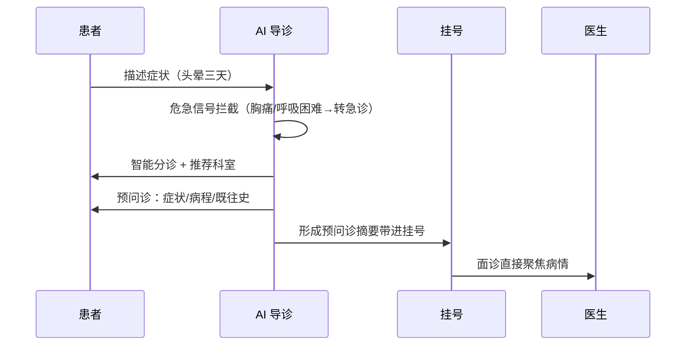

# AI 导诊预问诊

> 「我头晕，该挂神经内科还是心内科？」——这是患者问得最多、也最难一句话答清的问题。答错了，患者白跑一趟、挂错科再转科；答得慢，导诊台被反复咨询淹没。
> FastGPT 把「分诊 + 预问诊」放在挂号之前：患者描述症状，AI 按科室与症状规则智能分诊、推荐科室，并在挂号前把「症状、病程、既往史」这些医生必问的问题先采集一遍，形成预问诊摘要直接带进面诊。
> 某医院上线后，导诊台重复咨询减少、挂错科转科减少，医生面诊从「一问一答补信息」变成「直接聚焦病情」，候诊时间缩短。

> 【插图占位：导诊预问诊对话】
> 图片类型：界面截图
> 图片内容：患者输入「头晕三天，站起来加重」，AI 推荐科室并追问症状/病程/既往史，形成结构化预问诊摘要
> 获取方式：截图——FastGPT 应用 → 调试预览，输入一条症状描述触发生成，截「症状输入 + 分诊推荐 + 预问诊摘要」同屏画面，患者信息打码

---

## 一、场景洞察与痛点

### 1.1 为什么导诊预问诊值得做 AI

把一次就诊的完整旅程画出来，会发现真正看病的几分钟之外，有一大段路是空的：找对科室、反复回答同样的基础问题。多数医院不是没有导诊台和挂号系统——导诊台、自助机、App 都上了不少——而是**这些设施只承载了「分诊这件事发生」，没解决「分诊和预问诊这两件挂号前的事自动完成」**：挂哪个科靠患者自我判断，基础问询靠导诊台反复人工回答，医生面诊还要从头一问一答补症状。于是就诊的价值链条断裂在「挂号前」：患者白跑的路、医生被挤占的时间，都浪费在「分诊没做对、预问诊没做在前」上。这正是 AI 能补上的空位——**把「分诊 + 预问诊」放到挂号之前，让每一次面诊都从「补信息」回到「看病情」**。

### 1.2 共性痛点因链

| 现象 | 谁在受罪 | 根因 |
|------|---------|------|
| 挂错科、白跑一趟再转科 | 患者耗时、体验差 | 分诊靠患者自我判断 |
| 导诊台被反复咨询淹没 | 护士负担重 | 常见问题反复人工回答 |
| 医生面诊一问一答补信息 | 医生时间被挤占 | 预问诊信息在挂号前缺失 |
| 候诊时间长 | 患者体验差 | 面诊被基础问询拖慢 |

四大根因不是孤立的，而是层层递进的同一条链：**分诊靠自我判断 → 导诊靠人工重复 → 预问诊缺失 → 面诊被拖慢**。前面一环没自动化，后面一环只会更堵。下面第二章的每个模块，就把「分诊」和「预问诊」这两件事放到挂号之前解决。

### 1.3 适用条件

本方案适合具备以下条件的组织，条件越充分、收益越显著：

- 门诊量大的综合 / 专科医院，有导诊台负担与挂错科问题；
- 有相对规范的科室分诊规则、症状库、预问诊问项（这是 AI 分诊的原料）；
- 有明确的医疗责任方（AI 只分诊、不诊断，危急重症必须转人工急诊）；
- 患者已使用公众号 / 小程序 / APP / 自助机等入口（降低采用门槛）；
- 有 HIS / 挂号 / 分诊 / EMR 系统可对接（分诊摘要才能带进面诊）。

> 若涉及危急重症，系统先做**危急信号拦截**（如胸痛、呼吸困难）并优先转人工急诊——这是对患者负责的底线，任何导诊方案都不能替代急诊分诊。

---

## 二、解决方案设计

### 2.1 总体蓝图

先看现状——就诊旅程的「挂号前」这一段是空的，断点全卡在「靠人」：



接入 FastGPT 后，就诊旅程的「挂号前」这一段被补上了：



> 【插图占位：导诊预问诊业务架构图】
> 图片类型：架构图
> 图片内容：数据源（科室分诊规则/症状库/预问诊问项/HIS）→ 能力层（危急拦截/智能分诊/预问诊采集/摘要生成）→ 渠道层（公众号/小程序/APP/自助机/官网）四层纵向
> 获取方式：制图——Mermaid 画四层纵向分层图，每层标注职责

### 2.2 多渠道 × 多系统覆盖

同一套分诊规则与预问诊摘要，患者从哪个入口进来都能用：

| 入口/系统 | 接入方式 | 场景 |
|------|------|------|
| 公众号 / 小程序 / APP | API 接入 | 患者在家描述症状、自助分诊与预问诊 |
| 自助机 / 官网 | 嵌入 / iframe | 到院后自助分诊、扫码预问诊 |
| 企微 / 钉钉 / 飞书 | OpenAPI 接入 | 院内外协、内部协作 |
| HIS / 挂号 / 分诊 / EMR 系统 | API / 插件对接 | 分诊摘要带进挂号与病历 |

> 两个维度分开看，缺一不可：**渠道**是「患者从哪进来咨询」（公众号、小程序、APP、自助机、官网），解决分诊的入口覆盖；**系统**是「AI 接谁的挂号与病历」（HIS、挂号、分诊、EMR），解决分诊摘要的业务打通。只有渠道没有系统，方案就成了「只有前台没有后台」的分诊框；只有系统没有渠道，患者又不知道从哪进。

落到一个具体画面：患者在公众号里描述症状、在自助机旁扫码预问诊，分诊摘要经挂号系统带进 EMR、面诊时医生直接看到——两个入口、两套后端，背后是同一套分诊规则与预问诊摘要。

### 2.3 痛点一一对应解决（因果闭环）

四个模块不是功能堆叠，而是一条链：**智能分诊 → 常见问答自动化 → 预问诊采集 → 摘要带进面诊**。每个模块都在消灭一个具体痛点，落地后变成一个可观察的结果：

| 客户痛点（脱敏） | 方案模块 | 落地后的结果 |
|------|---------|------------|
| 挂错科白跑一趟 | ① 智能分诊 | 按症状规则推荐科室，挂错科减少 |
| 导诊台反复咨询 | ② 常见问答自动化 | 常见问题 AI 答，护士减负 |
| 医生面诊一问一答 | ③ 预问诊采集 | 症状/病程/既往史挂号前采好 |
| 候诊时间长 | ④ 摘要带进面诊 | 医生直接聚焦病情，面诊提速 |

**设计原则：AI 不越权**——导诊只做分诊建议与信息采集、不诊断不处方；危急信号（胸痛/呼吸困难等）强制拦截转急诊；分诊结果供患者参考、可改挂；预问诊摘要供医生参考、不替代问诊。

### 2.4 长尾与边界场景（枚举四问）

主流程之外，主动把复杂场景点出来，证明方案经得起生产追问：

1. **分诊/症状异常**：症状模糊、多科室交叉、罕见病——AI 给多科室建议并标置信度，低置信转人工。
2. **危急/安全异常**：危急重症、需急救——强制转急诊、优先提示，AI 不替代急诊分诊。
3. **输入/表达异常**：方言、口语化描述——关键词归一，理解不清标黄。
4. **权限/合规异常**：患者隐私、越权访问——病历数据留内网、按角色控可见、全程留痕。

**能主动写出「哪些情况必须转人工急诊」，是这套方案成熟度的标志。**

### 2.5 人机分工总表

| 环节 | AI 全自动 | AI 生成 + 人工确认 | 人工主导 |
|------|:---:|:---:|:---:|
| 智能分诊、常见问答、预问诊采集 | ● | | |
| 摘要生成带进面诊 | ● | | |
| 低置信分诊、存疑信息核验 | | ● | |
| 危急重症分诊与急救 | | | ● |
| 诊断、处方、治疗决策 | | | ● |

这张表是整个方案的地基：**AI 负责「能自动完成的分诊与采集」，人负责「需要判断力的诊断与急救」**。客户对 AI 的信任，来自它知道自己不诊断、不处方、危急必转急诊。

> 【插图占位：人机分工泳道图】
> 图片类型：人机分工图
> 图片内容：AI 全自动 / AI 生成+人工确认 / 人工主导 三列泳道，标出导诊预问诊各环节落在哪一列
> 获取方式：制图——Mermaid 画三列泳道图，把上表各环节落到对应泳道

---

## 三、落地价值与收益

### 3.1 价值维度

| 维度 | 面向对象 | 价值主张 |
|------|---------|---------|
| 患者体验 | 患者 | 少挂错科、少白跑、少反复回答同样的问题 |
| 导诊减负 | 护士 | 常见咨询 AI 答，导诊台不再被淹没 |
| 医生效率 | 医生 | 面诊从「补信息」回到「看病情」 |
| 分诊质量 | 医院 | 分诊有规则、可追溯，导诊资源有据可调 |

### 3.2 量化框架（指标三件套）

每个数字都按「落地前 → 落地后 → 为什么变」交代因果，而非甩一个百分比：

| 价值维度 | 衡量口径 | 落地前 | 落地后 | 为什么变 |
|---------|---------|-------|-------|---------|
| 分诊准确 | 挂错科率 | 靠患者自我判断 | 显著下降 | 按科室/症状规则分诊，替代自我判断 |
| 导诊减负 | 常见咨询自动化率 | 导诊台人工答 | 大幅提升 | 常见问题 AI 答，护士专注复杂咨询 |
| 预问诊完整 | 预问诊完整率 | 挂号前缺失 | 挂号前采好 | 症状/病程/既往史在挂号前自动采集 |
| 面诊效率 | 面诊聚焦度 | 一问一答补信息 | 直接聚焦病情 | 预问诊摘要带进面诊，医生少补基础信息 |

下面这张热力图，把「各科室 × 各时段的咨询强度」画出来——它就是导诊资源该往哪调的依据：

```echarts
{
  "title": { "text": "各科室 × 各时段咨询强度", "subtext": "颜色越深咨询越密集，导诊资源往深色时段调", "left": "center" },
  "tooltip": { "position": "top" },
  "xAxis": { "type": "category", "data": ["早高峰", "上午", "中午", "下午", "晚高峰"] },
  "yAxis": { "type": "category", "data": ["内科", "外科", "儿科", "妇产科", "急诊"] },
  "visualMap": { "min": 0, "max": 100, "calculable": true, "inRange": { "color": ["neutral", "primary"] } },
  "series": [
    {
      "type": "heatmap",
      "data": [
        [0, 0, 45], [1, 0, 60], [2, 0, 30], [3, 0, 55], [4, 0, 70],
        [0, 1, 30], [1, 1, 40], [2, 1, 20], [3, 1, 35], [4, 1, 45],
        [0, 2, 80], [1, 2, 70], [2, 2, 40], [3, 2, 65], [4, 2, 90],
        [0, 3, 50], [1, 3, 55], [2, 3, 35], [3, 3, 60], [4, 3, 65],
        [0, 4, 90], [1, 4, 85], [2, 4, 75], [3, 4, 88], [4, 4, 95]
      ],
      "label": { "show": false }
    }
  ]
}
```

这张热力图把「导诊资源该往哪调」这件事画成一个可操作的依据：急诊全时段深色、儿科早高峰和晚高峰深色、外科中午最浅——颜色越深咨询越密集，导诊台和预问诊资源就往深色时段倾斜。它讲的是「AI 分诊不只给患者指路，还给医院留下了分诊数据」，而不是甩一个「分诊准确率 95%」的空数字。

### 3.3 ROI 与回本周期

「值不值」要算得出来：**回本周期 = 一次性投入 ÷ 月净收益**，公开场景用区间与百分比表达，不写绝对金额：

| 类别 | 构成 |
|------|------|
| 一次性投入 | 软件授权 / License、服务器或云资源、实施与集成、科室/症状分诊规则冷启动、培训 |
| 持续性投入 | 模型调用 / API 费用、运维人力、分诊规则与症状库更新 |
| 收益（钱） | 挂错科转科减少、导诊人力释放、面诊提速带来的医疗资源节省 |
| 收益（折算） | 患者体验提升、候诊时间缩短的长期价值 |

> 某医院脱敏参考：一次性投入主要为授权 + 实施 + 分诊规则冷启动，月净收益来自挂错科转科减少、导诊人力释放与面诊提速，**预计 6-10 个月回本**；未计入患者体验提升的长期价值，属保守估算。回本周期用区间表达、不承诺具体数值；正式交付以医院自身门诊量与转科数据按月复测，用数据说话。

---

## 四、落地路径与运营

### 4.1 分阶段推进节奏

方案落地遵循「**先验证、再试点、后规模化**」，每阶段有明确动作和验收口径：

| 阶段 | 目标 | 典型动作 | 验收口径 |
|------|------|---------|---------|
| 验证 | 用真实样本证明核心链路可行 | 拿咨询量最大的科室（如内科/儿科）测分诊准确率 | 分诊准确率、危急拦截达到约定口径 |
| 试点 | 在一个院区/门诊真跑 | 某院区上线，收集医护反馈 | 挂错科率、预问诊完整率达到口径 |
| 规模化 | 覆盖全院科室与全渠道 | 对接 HIS/挂号/分诊/EMR，全量上线 | 全量运行，分诊规则维护闭环建立，运营机制运转 |

> 具体周期和阈值视医院规模、门诊条件与配合度调整；我们不承诺「一次上线、永久可用」，而是交付可持续运营的机制。

### 4.2 数据与规则冷启动

- 优先梳理**科室/症状分诊规则、常见问答、预问诊问项**，这是分诊与采集的地基；
- 先用小批量症状样本验证分诊准确率，再增量补充历史分诊数据；
- 每批导入后人工抽检、纠错回流，避免「错的分诊规则越滚越大」。

### 4.3 持续运营闭环

- **分诊纠错回流**：低置信分诊被人工纠正后，回流优化分诊规则；
- **症状库迭代**：业务方补充新症状、修订旧规则，同步到分诊引擎；
- **效果复测**：按月复测挂错科率、预问诊完整率，找出下滑原因；
- **规则更新**：科室分诊规范修订后同步更新，杜绝「旧规则误导新患者」。

> 【插图占位：运营仪表板截图】
> 图片类型：界面截图
> 图片内容：分诊量、挂错科率、预问诊完整率的运营曲线
> 获取方式：截图——FastGPT 应用 → 数据统计，截运营仪表板，展示「越用越准」的复测闭环

---

## 五、选型价值与下一步

### 5.1 FastGPT 企业级价值（能力 → 证据 → 收益）

我们交付的不是一个工具，而是一套跑得通、控得住、越用越准的导诊预问诊体系。它建立在这些企业级能力之上：

| 能力 | 证据 | 对导诊场景的收益 |
|------|------|----------------|
| 私有化部署，数据自控 | 系统部署在医院内网 | 患者与病历数据不出网，满足隐私合规 |
| OpenAPI 完整开放 | 兼容 OpenAI 接口格式 | 对接 HIS/挂号/分诊/EMR，AI 嵌入现有流程 |
| 模型无关 | 可切换 DeepSeek/通义千问/GLM 等 | 医疗场景选性价比最优，不被单一模型供应商绑定 |
| 零代码可视化编排 | 现有 IT 团队拖拽搭建 | 从零到上线约 4-6 周，无需招聘 AI 工程师 |
| 免费 POC 概念验证 | 针对真实场景搭建验证 | 用真实症状实测分诊准确率与预问诊质量，零风险试用 |

### 5.2 选型顾虑回应

- **对比医疗导诊 SaaS**：SaaS 多为按流量/账号收费、数据在第三方、分诊规则难深度定制；本方案私有化部署、分诊规则可按医院持续迭代，更适合对数据合规与分诊准确要求高的机构。
- **对比自研方案**：自研需要 AI 工程师与数月研发周期；本方案基于成熟底座与可视化编排，由现有 IT 团队在数周内落地。
- **对比通用 AI 助手**：通用助手缺 HIS 对接与危急拦截，无法把分诊摘要带进面诊；本方案内置危急信号拦截、智能分诊与预问诊采集，并与挂号系统打通。

### 5.3 预约免费 POC

> 如需进一步验证，点击页面右侧「预约免费 POC」，用医院自身的科室/症状规则，实测分诊准确率与预问诊完整率，用数据验证前文落地效果。
