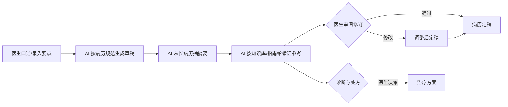

# AI 临床诊疗辅助

> 医生的时间不该花在抄病历上。可现实是：下夜班的医生还在补白天的病历，一份病历少说十几分钟；遇到复杂病例，还要翻指南、查文献、比用药。真正用在患者身上的时间，被这些「案头工作」一点点挤掉。
> FastGPT 把「写病历、摘信息、查证据」这三件案头活交给 AI：医生口述/录入要点，AI 按病历规范生成草稿、从长病历里自动抽摘要，并按医院知识库与指南提供循证参考。医生从「抄 + 查」回到「判断 + 决策」。
> 某医院呼吸科接入后，单份病历书写时间从十几分钟降到几分钟，医生面诊时间占比提升，复杂病例的循证参考更及时。

> 【插图占位：病历书写与摘要辅助】
> 图片类型：界面截图
> 图片内容：左侧医生录入要点/口述，右侧 AI 生成规范病历草稿，底部是从长病历自动抽出的患者摘要与循证参考
> 获取方式：截图——FastGPT 应用 → 调试预览，输入一段病历要点触发生成，截「要点输入 + 病历草稿 + 摘要」同屏画面，患者与医生信息打码

---

## 一、场景洞察与痛点

### 1.1 为什么临床诊疗辅助值得做 AI

把医生的一天拆开，会发现「案头工作」悄悄吃掉了本属于患者的时间。多数医院不是没有信息系统——HIS、EMR、LIS/PACS 早就建起来了——而是**这些系统只承载了「病历存哪里」，没解决「病历怎么高效写出来、信息怎么高效摘出来、证据怎么快速查出来」**：病历靠逐字录入，长病历的关键信息淹没在长文里，复杂病例的循证资料散落难检索。于是诊疗的价值链条断裂在「记录与检索」上：医生被「记录」和「检索」这两件机械的事困住了，而「判断」和「决策」这些只有人能做的事反被压缩。这正是 AI 能补上的空位——**把「记录」和「检索」交给 AI，把「判断」和「决策」留给医生**。

### 1.2 共性痛点因链

| 现象 | 谁在受罪 | 根因 |
|------|---------|------|
| 病历书写耗时、占满下班时间 | 医生负担重 | 病历靠逐字录入 |
| 长病历翻起来慢、抓不住重点 | 医生效率低 | 关键信息淹没在长文里 |
| 复杂病例查指南/文献耗时 | 医生查证难 | 循证资料散、检索慢 |
| 面诊时间被案头工作挤占 | 患者体验差 | 医生时间分配失衡 |

四大根因不是孤立的，而是层层递进的同一条链：**病历靠录入 → 摘要靠翻 → 证据靠查 → 面诊被挤占**。前面一环没自动化，后面一环只会更挤。下面第二章的每个模块，就把「记录」和「检索」这两件机械的事交给 AI，把「判断」和「决策」留给医生。

### 1.3 适用条件

本方案适合具备以下条件的组织，条件越充分、收益越显著：

- 病历量大、医生案头负担重、有规范病历要求与循证需求的医院科室；
- 有相对规范的病历模板与科室/病种规则（这是 AI 生成草稿的原料）；
- 有 HIS / EMR / LIS/PACS 系统与知识库 / 指南库可对接（循证参考才有据）；
- 有明确的医疗责任方（AI 只辅助、不替代诊断与处方决策）；
- 有危急重症诊疗的兜底机制（AI 仅作辅助，医疗安全是底线）。

> 若涉及危急重症诊疗，AI 仅作辅助、**不替代医生的诊断与处方决策**——这是医疗安全的底线，任何辅助方案都不能越过医生。

---

## 二、解决方案设计

### 2.1 总体蓝图

先看现状——医生被「记录」和「检索」困住，断点全卡在「靠人」：


接入 FastGPT 后，医生的案头工作被接走了大半：



> 【插图占位：临床诊疗辅助业务架构图】
> 图片类型：架构图
> 图片内容：数据源（HIS/EMR/LIS/PACS/知识库/指南库）→ 能力层（病历生成/摘要抽取/循证参考）→ 渠道层（医生工作站/移动端/企微/钉钉/飞书/API）四层纵向
> 获取方式：制图——Mermaid 画四层纵向分层图，每层标注职责

### 2.2 多渠道 × 多系统覆盖

同一套病历规范与知识库在背后复用，医生从哪个入口进来都能用：

| 入口/系统 | 接入方式 | 场景 |
|------|------|------|
| 医生工作站 | 登录门户 / iframe | 写病历、看摘要、查循证参考 |
| 移动端 | API 接入 | 查房时查看摘要、口述录入要点 |
| 企微 / 钉钉 / 飞书 | OpenAPI 接入 | 科室协作、会诊时共享摘要 |
| HIS / EMR / LIS/PACS / 知识库 / 指南库 | API / 插件对接 | 病历存取、检验影像、循证参考的数据底座 |

> 两个维度分开看，缺一不可：**渠道**是「医生从哪进来用」（医生工作站、移动端、IM、API），解决辅助的入口；**系统**是「AI 接谁的病历与知识」（HIS、EMR、LIS/PACS、知识库、指南库），解决草稿与参考的业务打通。只有渠道没有系统，方案就成了「只有前台没有后台」的辅助框；只有系统没有渠道，医生又不知道从哪进。

落到一个具体画面：医生在工作站里口述要点生成病历草稿、在移动端查房时看摘要、在企微群里查循证参考——三个入口、多套后端，背后是同一套病历规范与知识库。

### 2.3 痛点一一对应解决（因果闭环）

四个模块不是功能堆叠，而是一条链：**病历辅助生成 → 摘要自动抽取 → 循证参考 → 案头工作减负**。每个模块都在消灭一个具体痛点，落地后变成一个可观察的结果：

| 客户痛点（脱敏） | 方案模块 | 落地后的结果 |
|------|---------|------------|
| 病历书写耗时 | ① 病历辅助生成 | 口述/录入要点 → 规范草稿，几分钟定稿 |
| 长病历抓不住重点 | ② 摘要自动抽取 | 关键信息结构化，一目了然 |
| 查指南/文献耗时 | ③ 循证参考 | 按知识库/指南给参考，检索提速 |
| 面诊时间被挤占 | ④ 案头工作减负 | 医生时间回到面诊与决策 |

**设计原则：AI 不越权**——病历只出草稿与摘要、定稿权在医生；循证参考只做信息检索、不下诊断不处方；危急重症诊疗由医生决策、AI 不替代；患者隐私数据留内网、全程留痕。

### 2.4 长尾与边界场景（枚举四问）

主流程之外，主动把复杂场景点出来，证明方案经得起生产追问：

1. **病历/专科异常**：病历不规范、专科差异、术语多——按科室/病种配置模板，边界项标黄提示。
2. **病情/证据异常**：复杂病例、罕见病、指南缺失——AI 给参考、医生主导决策，不确定项标黄。
3. **输入/表达异常**：方言、口语化口述——语音识别归一，理解不清标黄转人工。
4. **权限/合规异常**：患者隐私、越权访问、诊疗留痕——数据留内网、按角色控可见、全程留痕。

**能主动写出「AI 不替代哪些医疗决策」，是这套方案成熟度的标志。**

### 2.5 人机分工总表

| 环节 | AI 全自动 | AI 生成 + 人工确认 | 人工主导 |
|------|:---:|:---:|:---:|
| 病历草稿生成、摘要抽取 | ● | | |
| 循证参考检索 | ● | | |
| 病历审阅修订 | | ● | |
| 诊断与处方决策 | | | ● |
| 危急重症诊疗 | | | ● |

这张表是整个方案的地基：**AI 负责「能自动完成的记录与检索」，人负责「需要判断力的诊断与决策」**。客户对 AI 的信任，来自它知道自己不下诊断、不处方、不替医生决策。

> 【插图占位：人机分工泳道图】
> 图片类型：人机分工图
> 图片内容：AI 全自动 / AI 生成+人工确认 / 人工主导 三列泳道，标出诊疗辅助各环节落在哪一列
> 获取方式：制图——Mermaid 画三列泳道图，把上表各环节落到对应泳道

---

## 三、落地价值与收益

### 3.1 价值维度

| 维度 | 面向对象 | 价值主张 |
|------|---------|---------|
| 医生减负 | 医生 | 从「抄病历 + 查资料」回到「判断 + 决策」 |
| 诊疗效率 | 医生、患者 | 面诊时间占比提升，患者等待与沟通更充分 |
| 循证质量 | 医生、患者 | 复杂病例的循证参考更及时、更有据 |
| 医疗安全 | 医院、管理层 | 病历规范、诊疗留痕、危急重症由医生决策兜底 |

### 3.2 量化框架（指标三件套）

每个数字都按「落地前 → 落地后 → 为什么变」交代因果，而非甩一个百分比：

| 价值维度 | 衡量口径 | 落地前 | 落地后 | 为什么变 |
|---------|---------|-------|-------|---------|
| 书写效率 | 单份病历书写时间 | 十几分钟 | 几分钟 | 口述/录入要点 → 规范草稿替代逐字录入 |
| 摘要效率 | 长病历抓重点耗时 | 翻长文 | 结构化摘要一目了然 | 关键信息自动抽取，不再淹没在长文里 |
| 查证效率 | 循证参考检索耗时 | 散、慢 | 按知识库/指南给参考 | 循证资料统一接入，检索提速 |
| 时间分配 | 医生面诊时间占比 | 被案头挤占 | 提升 | 案头工作减负，时间回到面诊与决策 |

下面这张横向条形图，把「医生时间花在哪」按耗时排出来——抄病历、查资料排在前，正是 AI 该接手的部分：

```echarts
{
  "title": { "text": "医生时间花在哪", "subtext": "越长越靠上，抄病历与查资料是 AI 的切入点", "left": "center" },
  "tooltip": { "trigger": "axis", "axisPointer": { "type": "shadow" } },
  "grid": { "left": "12%", "right": "6%", "top": "16%", "bottom": "8%", "containLabel": true },
  "xAxis": { "type": "value", "name": "占工作时间比例（%）" },
  "yAxis": { "type": "category", "data": ["病历书写", "查指南/文献", "面诊与沟通", "查房", "会诊"] },
  "series": [
    {
      "type": "bar",
      "data": [
        { "value": 30, "itemStyle": { "color": "primary" } },
        { "value": 15, "itemStyle": { "color": "primary" } },
        { "value": 35, "itemStyle": { "color": "success" } },
        { "value": 12, "itemStyle": { "color": "neutral" } },
        { "value": 8, "itemStyle": { "color": "neutral" } }
      ]
    }
  ]
}
```

这张横向条形图把「医生时间花在哪」这件事摊开来看：病历书写 30%、查指南/文献 15%——这两件案头活加起来近一半，正是 AI 该接手的部分；而面诊与沟通只有 35%，被记录和检索挤占。它讲的是「AI 切入点的选择依据」，而不是甩一个「效率提升 50%」的空数字——先把医生的时间账算清楚，才知道该把哪些活交给 AI。

### 3.3 ROI 与回本周期

「值不值」要算得出来：**回本周期 = 一次性投入 ÷ 月净收益**，公开场景用区间与百分比表达，不写绝对金额：

| 类别 | 构成 |
|------|------|
| 一次性投入 | 软件授权 / License、服务器或云资源、实施与集成、病历模板与知识库冷启动、培训 |
| 持续性投入 | 模型调用 / API 费用、运维人力、病历模板与知识库更新 |
| 收益（钱） | 病历书写时间释放、面诊时间占比提升带来的医疗资源节省 |
| 收益（折算） | 循证参考及时带来的诊疗质量提升、患者体验改善 |

> 某医院呼吸科脱敏参考：一次性投入主要为授权 + 实施 + 病历模板冷启动，月净收益来自病历书写时间释放与面诊时间占比提升，**预计 6-10 个月回本**；未计入诊疗质量提升的长期价值，属保守估算。回本周期用区间表达、不承诺具体数值；正式交付以科室自身病历量与医生成本按月复测，用数据说话。

---

## 四、落地路径与运营

### 4.1 分阶段推进节奏

方案落地遵循「**先验证、再试点、后规模化**」，每阶段有明确动作和验收口径：

| 阶段 | 目标 | 典型动作 | 验收口径 |
|------|------|---------|---------|
| 验证 | 用真实样本证明核心链路可行 | 拿病历量大的科室（如呼吸科/内科）测病历草稿质量与摘要准确率 | 草稿规范性、摘要准确率达到约定口径 |
| 试点 | 在一个病区真跑 | 某病区上线，收集医护反馈 | 病历书写时间、面诊占比达到口径 |
| 规模化 | 覆盖多科室、多病种 | 对接 HIS/EMR/LIS/PACS/知识库，全量上线 | 全量运行，模板维护闭环建立，运营机制运转 |

> 具体周期和阈值视医院规模、科室条件与配合度调整；我们不承诺「一次上线、永久可用」，而是交付可持续运营的机制。

### 4.2 数据与规则冷启动

- 优先梳理**病历模板、科室/病种规则、知识库/指南库**，这是草稿生成与循证参考的地基；
- 先用小批量病历样本验证草稿质量与摘要准确性，再增量补充历史病历；
- 每批导入后人工抽检、纠错回流，避免「错的模板越滚越大」。

### 4.3 持续运营闭环

- **病历纠错回流**：草稿被医生修订后，回流优化病历模板；
- **知识库迭代**：业务方补充新病种、修订旧指南，同步到循证参考；
- **效果复测**：按月复测病历书写时间、面诊占比，找出下滑原因；
- **规则更新**：病历规范修订后同步更新，杜绝「旧模板写新病历」。

> 【插图占位：运营仪表板截图】
> 图片类型：界面截图
> 图片内容：病历生成量、草稿规范率、面诊占比的运营曲线
> 获取方式：截图——FastGPT 应用 → 数据统计，截运营仪表板，展示「越用越准」的复测闭环

---

## 五、选型价值与下一步

### 5.1 FastGPT 企业级价值（能力 → 证据 → 收益）

我们交付的不是一个工具，而是一套跑得通、控得住、越用越准的临床诊疗辅助体系。它建立在这些企业级能力之上：

| 能力 | 证据 | 对诊疗辅助场景的收益 |
|------|------|----------------|
| 私有化部署，数据自控 | 系统部署在医院内网 | 病历与患者数据不出网，满足隐私合规 |
| OpenAPI 完整开放 | 兼容 OpenAI 接口格式 | 对接 HIS/EMR/LIS/PACS/知识库，AI 嵌入现有流程 |
| 模型无关 | 可切换 DeepSeek/通义千问/GLM 等 | 医疗场景选性价比最优，不被单一模型供应商绑定 |
| 零代码可视化编排 | 现有 IT 团队拖拽搭建 | 从零到上线约 4-6 周，无需招聘 AI 工程师 |
| 免费 POC 概念验证 | 针对真实场景搭建验证 | 用真实病历实测草稿质量与摘要准确率，零风险试用 |

### 5.2 选型顾虑回应

- **对比医疗 AI SaaS**：SaaS 多为按流量/账号收费、数据在第三方、模板难深度定制；本方案私有化部署、模板与知识库可按医院持续迭代，更适合对数据合规与医疗安全要求高的机构。
- **对比自研方案**：自研需要 AI 工程师与数月研发周期；本方案基于成熟底座与可视化编排，由现有 IT 团队在数周内落地。
- **对比通用 AI 助手**：通用助手缺 HIS 对接与循证知识库，无法把病历摘要带进诊疗流程；本方案内置病历生成、摘要抽取与循证参考，并与 HIS/EMR 打通。

### 5.3 预约免费 POC

> 如需进一步验证，点击页面右侧「预约免费 POC」，用医院自身的病历模板与知识库，实测病历草稿质量与摘要准确率，用数据验证前文落地效果。
