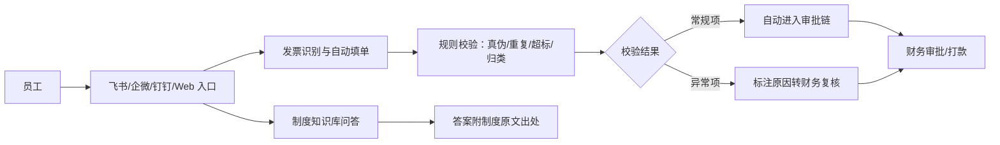
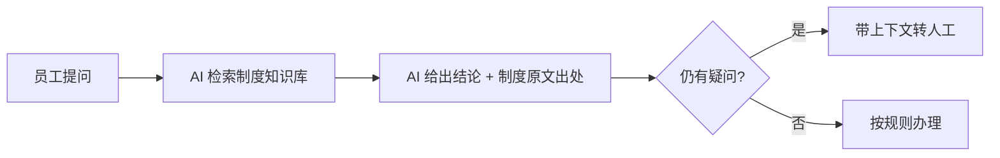
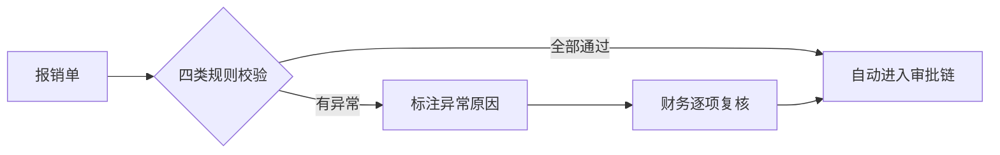

# AI 智能报销助手 · 企业费用报销解决方案

> 费用报销是每个组织都在跑的刚性流程，却长期困在"制度问不完、单据填不准、审核靠人肉、合规靠抽查"的泥潭里。
> FastGPT 团队基于智能知识问答、工作流编排与企业级私有化部署的成熟经验，提供一套端到端的费用报销智能化方案，覆盖制度问答、发票识别、自动填单、全量规则校验与人工例外复核，帮助企业把财务团队从重复劳动中释放出来，把合规从"抽查碰运气"升级为"全量兜底"。
> 方案中的具体效果口径，将在验证阶段以贵司真实数据实测后确认——我们不以虚构数字承诺结果。

---

## 一、场景洞察与痛点体系

### 1.1 为什么费用报销值得做 AI

费用报销几乎人人参与、月月发生，但长期处于"低效率、高摩擦、低透明"的状态。它不是没有系统（大多有 OA/财务系统），而是**系统只承载了流程，没有解决判断和知识的问题**——这正是 AI 能补上的空位。

### 1.2 共性痛点因链

| 现象 | 影响谁 | 根因 |
|------|--------|------|
| 填单慢、常被打回重填 | 员工垫资久、体验差；财务返工 | 发票信息靠手填，制度分散靠猜 |
| 财务逐单人工审核、翻制度 | 财务加班、出错、被审计挑战 | 超标、归类、真伪全靠人肉记忆判断 |
| 报销合规风险 | 财务负责人、管理层 | 重复报销、超标、虚假发票靠人工抽查，必有漏 |
| 制度问题反复被问 | 财务全员 | 制度知识没有沉淀成可检索的资产，同一问题反复解答 |

四大根因，层层递进：**制度知识分散 → 填单人工 → 审核靠人肉 → 流程黑盒**。解决方案的全部模块都从这里长出来。

### 1.3 适用条件

本方案适合具备以下条件的组织，条件越充分，收益越显著：

- 有较规范的报销制度和审批流（制度是知识库的原料）；
- 报销量达到一定规模（月均数百单以上，AI 才有规模收益）；
- 员工已使用飞书 / 企业微信 / 钉钉等办公入口（降低采用门槛）；
- 有明确的财务复核责任方（AI 不替财务做主，必须有人工兜底）。

> 若报销量极小、制度尚不健全，我们建议先补齐制度与流程，再启动智能化——这也是对客户负责的做法。

---

## 二、解决方案总体架构

### 2.1 总体蓝图

### 2.2 四大能力模块

| 模块 | 对应根因 | 职责 | 核心设计原则 |
|------|---------|------|-------------|
| ① 制度知识库问答 | 制度知识分散 | 让员工先问 AI，答案带出处 | 只答制度有依据的问题，不替财务解释个例 |
| ② 发票识别与自动填单 | 填单人工 | 上传票据自动识别要素、归类、填单 | 识别不确定的字段标黄由员工补填，不臆造 |
| ③ 规则校验引擎 | 审核靠人肉 | 真伪、重复、超标、归类四类校验全量跑 | 只出结论与原因，最终裁决权始终在财务 |
| ④ 流程透明与差旅关联 | 流程黑盒 | 差旅自动关联出差审批，进度可查 | 关联只做建议与提醒，不替代审批决策 |

四个模块不是功能堆叠，而是一条链：**知识回答 → 自动填单 → 全量校验 → 人工例外裁决**。每一环都在承接上一个环节暴露的问题。

### 2.3 架构设计的三条硬约束

1. **AI 不做财务决定**：打款、异常裁决、制度解释冲突，最终由财务人工确认。
2. **校验全量、裁决例外**：规则校验对每一单都跑，人工只处理被标记的异常单。
3. **数据安全与全程可审计**：票据与费用数据留存于企业内网，权限最小化隔离，关键操作全程留痕、可追溯。

---

## 三、分场景解法与人机协同

### 3.1 人机分工总表

| 环节 | AI 全自动 | AI 生成 + 人工确认 | 人工主导 |
|------|:---:|:---:|:---:|
| 制度问答 | ● | | |
| 发票要素识别、归类建议 | ● | | |
| 真伪/重复/超标/归类校验 | ● | | |
| 差旅关联出差审批 | | ● | |
| 异常项复核与裁决 | | | ● |
| 打款 | | | ● |
| 制度制定与更新 | | | ● |

这张表是整个方案的地基：**AI 负责"能自动判定的判定"，人负责"需要判断力的裁决"**。客户对 AI 的信任，来自它知道自己不管钱、不拍板。

### 3.2 场景 A：员工自助制度问答

- **痛点**："出差打车能不能报""招待费标准多少"只能问财务，财务一天答几十遍同一类问题。
- **解法**：报销制度、差旅标准、归类规则、FAQ 建入知识库，员工在任何入口提问，AI 基于制度原文回答并附出处。
- **目标流程**：

- **设计要点**：答案必须有出处；涉及个例判断时 AI 给规则结论、财务做最终确认，AI 不"创造"制度。

### 3.3 场景 B：发票识别与自动填单

- **痛点**：员工手工填发票号、金额、日期、类型，填错被打回，来回好几轮。
- **解法**：上传发票/行程单/支付截图，自动识别开票方、金额、日期、税号，结合差旅审批判断费用类型（差旅、市内交通、招待、办公、员工福利等），自动生成报销单草稿，员工只需确认。
- **目标流程**：

- **设计要点**：识别不确定的字段必须标黄交由人工补填；退款、红冲、多人分摊、多币种折算、跨部门分摊等复杂金额场景交由财务复核，不做自动判定。

### 3.4 场景 C：规则校验与例外审核

- **痛点**：超标、重复报销、疑似虚假发票靠财务逐单翻制度、开网站验真，抽查必有漏。
- **解法**：报销单进入审批前，系统自动跑四类校验——发票真伪（对接税务核验）、重复报销（按发票号/金额/日期比对历史）、超标（对比差旅住宿/补贴标准）、归类合理性。常规项自动放行，异常项标注原因转财务复核。
- **目标流程**：

- **设计要点**：从"抽查"变"全检"，但全检的结论只服务于人工复核，不代替裁决；异常原因必须具体到"哪条规则、差多少"，便于财务快速判断。

---

## 四、落地路径与持续运营

### 4.1 分阶段推进节奏

方案落地遵循"**先验证、再试点、后规模化**"的节奏，每阶段有明确动作和验收口径：

| 阶段 | 目标 | 典型动作 | 验收口径 |
|------|------|---------|---------|
| 验证 | 用真实样本证明核心链路可行 | 导入制度与真实票据样本，测识别准确率、命中率、校验拦截率 | 各指标达到约定口径 |
| 试点 | 在一个报销量大的部门真跑 | 差旅多的部门（如销售）上线，收集使用反馈 | 填单耗时、咨询下降、审核效率达到口径 |
| 规模化 | 全公司推广并接入业务系统 | 对接 OA/ERP/资金系统，全量上线 | 全量运行，异常复核闭环，运营机制建立 |

> 具体周期和阈值根据组织规模、数据条件与财务配合度调整；我们不承诺"一次上线、永久可用"，而是交付可持续运营的机制。

### 4.2 知识库冷启动方法

- 优先导入**报销制度、差旅标准、归类规则、高频 FAQ**，这是问答准确率的地基；
- 先用小批量样本验证命中率，再增量补充历史案例与财务答疑记录；
- 每批导入后人工抽检，纠错后回流，避免"错的知识越滚越大"。

### 4.3 持续运营闭环

- **未命中问题回流**：AI 答不上的问题沉淀成新 FAQ，财务确认后入库；
- **规则迭代**：财务补充新规则、修订旧规则，同步到校验引擎；
- **效果复测**：按月复测识别准确率、命中率、拦截率，找出下滑原因；
- **知识更新**：制度修订后同步更新知识库，杜绝"旧制度误导"。

---

## 五、价值体系与量化框架

### 5.1 价值维度

| 维度 | 面向对象 | 价值主张 |
|------|---------|---------|
| 员工体验 | 全员 | 填单快、到账快、不用追着财务问 |
| 财务效率 | 财务团队 | 从逐单全审转向只审例外 |
| 合规风险 | CFO、管理层 | 从抽查碰运气变为全量兜底，有规则、有留痕 |
| 费用透明 | 管理层 | 费用结构、预算使用实时可见 |

### 5.2 价值量化框架（以实测数据为准）

每个价值维度都按"**衡量口径 + 数据来源 + 对照基准**"定义；具体目标值在验证阶段用贵司真实数据实测确定，落地后按月复测，用数据说话：

| 价值维度 | 衡量口径（示例） | 数据来源 | 价值机制 |
|---------|-----------------|---------|---------|
| 填单效率 | 单张报销单填单耗时 | 系统操作日志 | 识别 + 自动填单替代手工逐字段录入后大幅缩短 |
| 咨询自助化 | 报销类咨询中 AI 直接解决占比 | 问答记录 | 制度知识入库后可规模化自助 |
| 审核效率 | 财务审单从全审到只审异常 | 审批记录 | 规则全量校验后人工只处理异常项 |
| 违规拦截 | 重复/超标/疑似虚假项拦截覆盖 | 校验引擎日志 | 从人工抽查变为全量必查 |

> "价值机制"是变化的因果说明，不是承诺数值。正式方案中的目标值，将以贵司自身数据通过验证阶段实测后确认。

---

## 六、我们的专业能力与交付承诺

我们交付的不是一个工具，而是一套跑得通、控得住、越用越准的费用报销体系。支撑这套方案的专业能力，来自以下经多个场景反复验证的方法：

1. **痛点因链驱动设计**：先厘清"现象 → 影响 → 根因"，方案从根因长出来，而不是先谈功能——确保每一项投入都对准真实问题。
2. **人机分工先于技术选型**：先界定"哪些由 AI 全自动、哪些必须人裁决"，再设计系统，杜绝 AI 越权与"黑箱替人拍板"。
3. **全量校验 + 例外裁决**：规则对每一单全量执行，人工只处理被标记的例外，兼顾效率与合规。
4. **知识资产化**：把散落的制度、FAQ 沉淀成可检索、带出处、可更新的知识资产，让组织越用越厚。
5. **验证 → 试点 → 规模化**：先用小成本证明可行，再放大，控制落地风险。
6. **持续运营闭环**：未命中问题、规则、知识、效果四路持续回流，系统越用越准。

这套方法论已在智能客服、智能审批、合同审核等场景落地验证，可快速迁移到费用报销，降低交付风险、缩短见效周期。

> 如需进一步沟通，我们可以在 POC 阶段用贵司的真实制度与票据样本，实测识别准确率、命中率与校验拦截率，用数据验证方案价值。
