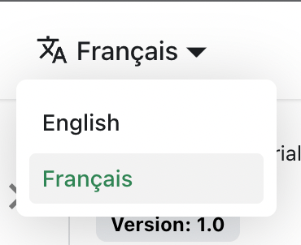

# Traduire votre site

Traduisons `docs/intro.md` en français.

## Configurer l'i18n

Modifiez `docusaurus.config.js` pour ajouter la prise en charge de la locale `fr` :

```js title="docusaurus.config.js"
export default {
  i18n: {
    defaultLocale: 'en',
    locales: ['en', 'fr'],
  },
};
```

## Traduire un document

Copiez le fichier `docs/intro.md` dans le dossier `i18n/fr` :

```bash
mkdir -p i18n/fr/docusaurus-plugin-content-docs/current/

cp docs/intro.md i18n/fr/docusaurus-plugin-content-docs/current/intro.md
```

Traduisez `i18n/fr/docusaurus-plugin-content-docs/current/intro.md` en français.

## Lancer votre site localisé

Démarrez votre site dans la locale française :

```bash
npm run start -- --locale fr
```

Votre site localisé est accessible à l'adresse [http://localhost:3000/fr/](http://localhost:3000/fr/) et la page `Getting Started` est traduite.

:::caution

En mode développement, vous ne pouvez utiliser qu'une seule locale à la fois.

:::

## Ajouter une liste déroulante de locales

Pour naviguer facilement entre les langues, ajoutez une liste déroulante de locales.

Modifiez le fichier `docusaurus.config.js` :

```js title="docusaurus.config.js"
export default {
  themeConfig: {
    navbar: {
      items: [
        // highlight-start
        {
          type: 'localeDropdown',
        },
        // highlight-end
      ],
    },
  },
};
```

La liste déroulante de locales apparaît désormais dans votre barre de navigation :



## Générer votre site localisé

Générez votre site pour une locale spécifique :

```bash
npm run build -- --locale fr
```

Ou générez votre site pour inclure toutes les locales à la fois :

```bash
npm run build
```
